# Fundamentos Spring Boot — Laboratorio 01

**Asignatura:** Programación y Plataformas Web  
**Institución:** Universidad Politécnica Salesiana  
**Carrera:** Ingeniería de Sistemas  
**Grupo:** ec.edu.ups.icc  
**Versión del proyecto:** 0.0.1-SNAPSHOT  

---

## Descripción general

Este repositorio agrupa las prácticas del primer laboratorio de la asignatura de Programación y Plataformas Web. Cada práctica amplía el proyecto con nuevas funcionalidades sobre el mismo servidor Spring Boot, el cual expone una API REST bajo el prefijo `/api`.

---

## Tecnologías utilizadas

| Tecnología        | Versión     |
|-------------------|-------------|
| Java              | 25          |
| Spring Boot       | 4.1.0       |
| Gradle (Kotlin)   | --          |
| Spring Web MVC    | (incluido)  |
| JUnit Platform    | (incluido)  |

---

## Configuración del servidor

El archivo `application.yml` define el puerto y el prefijo base de la API:

```yaml
server:
  port: 8080
  servlet:
    context-path: /api

spring:
  application:
    name: fundamentos01
```

Todos los endpoints quedan bajo el prefijo `/api`.

---

## Ejecución del proyecto

```bash
./gradlew bootRun
```

---

# Práctica 1 — Servidor y endpoints básicos

## Objetivo

Verificar la correcta configuración del entorno de desarrollo y demostrar el funcionamiento básico de un servidor web embebido mediante la exposición de endpoints REST de estado y listado de estudiantes.

---

## Estructura del proyecto — Práctica 1

```
fundamentos01/
├── src/main/java/ec/edu/ups/icc/fundamentos01/
│   ├── Fundamentos01Application.java
│   ├── core/
│   │   └── controllers/
│   │       └── StatusController.java
│   └── students/
│       ├── controllers/
│       │   └── StudentController.java
│       └── models/
│           └── Student.java
└── src/main/resources/
    └── application.yml
```

---

## Endpoints — Práctica 1

| Método | Ruta                  | Descripción                           |
|--------|-----------------------|---------------------------------------|
| GET    | `/api/status`         | Retorna el estado actual del servidor |
| GET    | `/api/students`       | Retorna la lista de estudiantes       |
| GET    | `/api/students/count` | Retorna el total de estudiantes       |

**Ejemplo de respuesta — `/api/status`:**

```json
{
  "status": "running",
  "service": "Spring Boot API",
  "timestamp": "2026-06-18T14:52:59.860601512"
}
```

**Ejemplo de respuesta — `/api/students`:**

```json
[
  { "id": 1, "name": "Juan", "age": 30 },
  { "id": 2, "name": "Diego", "age": 10 }
]
```

---

## Evidencias — Práctica 1

### 1. Verificación de la versión de Java

Salida del comando `java -version` en terminal, confirmando que el entorno cumple con el requisito de Java 25.

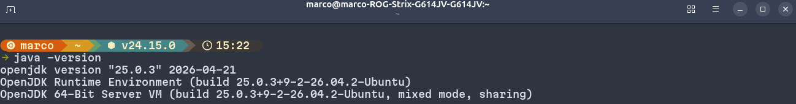

---

### 2. Servidor Spring Boot en ejecución

Salida de la consola al iniciar la aplicación, donde se observa el banner de Spring Boot y la confirmación de que Tomcat inició en el puerto 8080.

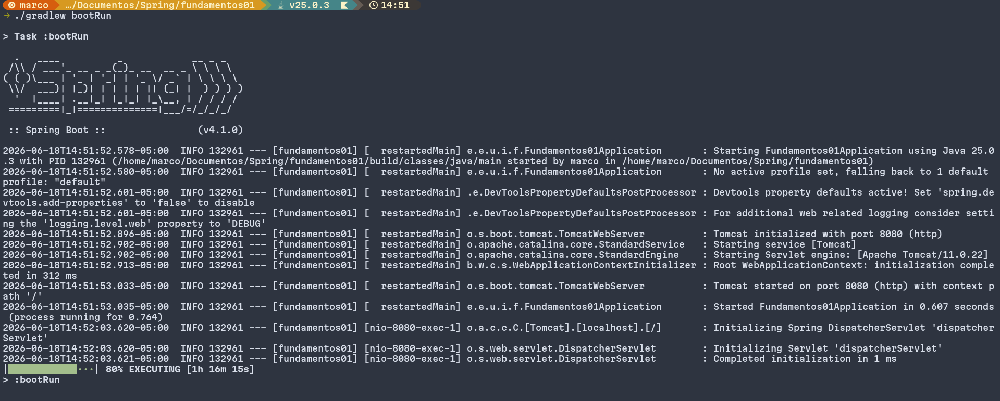

---

### 3. Endpoint `/api/status` funcionando

Respuesta JSON obtenida al acceder a `http://localhost:8080/api/status` desde el navegador.

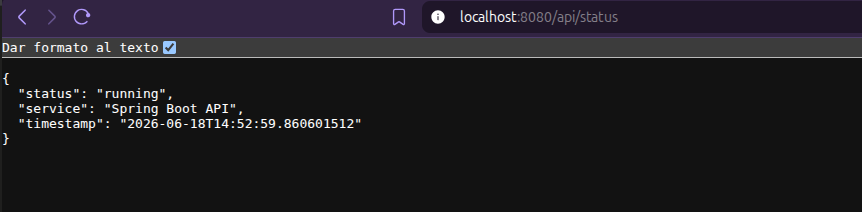

---

### 4. Listado de controladores en terminal

Salida del siguiente comando ejecutado desde la raíz del proyecto:

```bash
ls ./src/main/java/ec/edu/ups/icc/fundamentos01/controllers/
```

Resultado esperado:

```
StatusController.java
```

---

### 5. Endpoint `/api/students` funcionando

Respuesta JSON con la lista de estudiantes registrados en memoria.

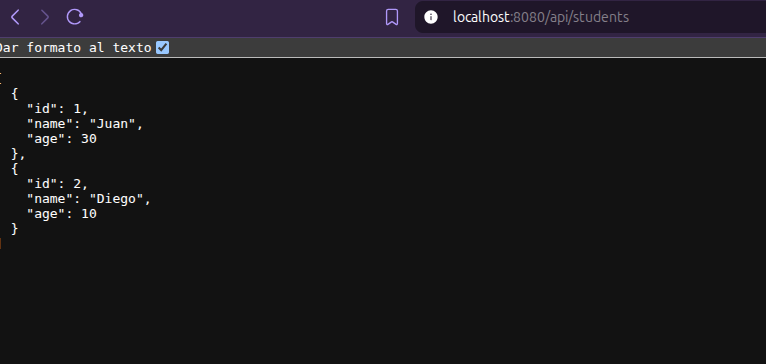

---

### 6. Endpoint `/api/students/count` funcionando

Respuesta con el total de estudiantes registrados.

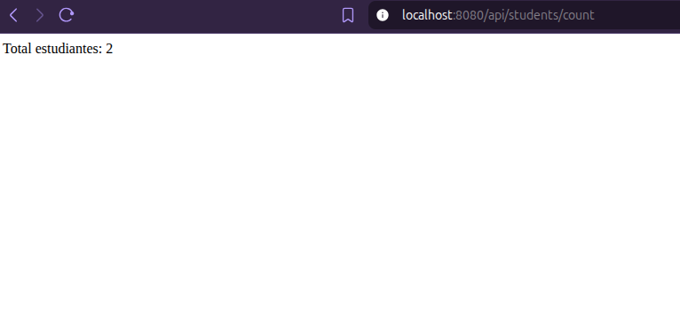

---

## Explicación personal — Práctica 1

### Funcionamiento del endpoint `/api/status`

El endpoint `/api/status` representa el punto de entrada más básico de la API construida con Spring Boot. Al recibir una solicitud HTTP de tipo GET en esa ruta, el método `status()` del controlador `StatusController` es invocado automáticamente por el framework. Este método retorna un mapa de clave-valor que Spring convierte en formato JSON antes de enviar la respuesta al cliente. Los campos retornados incluyen el nombre del servicio, su estado actual y la marca de tiempo del momento exacto en que se procesó la solicitud, lo que permite verificar que el servidor se encuentra activo y respondiendo correctamente.

### Función general de Spring Boot en la creación del servidor

Spring Boot simplifica el proceso de configuración y puesta en marcha de aplicaciones Java al proporcionar un servidor web embebido (Apache Tomcat) que se inicia junto con la aplicación, eliminando la necesidad de desplegar el proyecto en un servidor externo. La anotación `@SpringBootApplication` activa la configuración automática del contexto de aplicación, lo que permite que Spring detecte y registre los controladores REST de forma automática. Gracias a este enfoque, el desarrollador puede concentrarse en la lógica del negocio en lugar de gestionar manualmente la infraestructura del servidor.

---

# Práctica 2 — CRUD de productos y usuarios

## Objetivo

Implementar operaciones CRUD completas (Create, Read, Update, Delete) sobre dos recursos — productos y usuarios — aplicando una arquitectura en capas con controladores, servicios, repositorios, entidades y DTOs.

---

## Estructura del proyecto — Práctica 2

```
fundamentos01/
└── src/main/java/ec/edu/ups/icc/fundamentos01/
    ├── products/
    │   ├── controllers/
    │   │   └── ProductController.java
    │   ├── dtos/
    │   │   ├── CreateProductDto.java
    │   │   ├── UpdateProductDto.java
    │   │   ├── PartialUpdateProductDto.java
    │   │   └── ProductResponseDto.java
    │   ├── entities/
    │   │   └── ProductEntity.java
    │   ├── mappers/
    │   │   └── ProductMapper.java
    │   ├── models/
    │   │   └── ProductModel.java
    │   ├── repositories/
    │   │   └── ProductRepository.java
    │   └── services/
    │       ├── ProductService.java
    │       └── ProductServiceImpl.java
    └── users/
        ├── controllers/
        │   └── UserController.java
        ├── dtos/
        │   ├── CreateUserDto.java
        │   ├── UpdateUserDto.java
        │   ├── PartialUpdateUserDto.java
        │   └── UserResponseDto.java
        ├── entities/
        │   └── UserEntity.java
        ├── mappers/
        │   └── UserMapper.java
        ├── models/
        │   └── UserModel.java
        ├── repositories/
        │   └── UserRepository.java
        └── services/
            ├── UserService.java
            └── UserServiceImpl.java
```

---

## Endpoints — Práctica 2

### Productos

| Método | Ruta                  | Descripción                              |
|--------|-----------------------|------------------------------------------|
| GET    | `/api/products`       | Retorna la lista de todos los productos  |
| GET    | `/api/products/{id}`  | Retorna un producto por su id            |
| POST   | `/api/products`       | Crea un nuevo producto                   |
| PUT    | `/api/products/{id}`  | Actualiza completamente un producto      |
| PATCH  | `/api/products/{id}`  | Actualiza parcialmente un producto       |
| DELETE | `/api/products/{id}`  | Elimina un producto por su id            |

### Usuarios

| Método | Ruta               | Descripción                            |
|--------|--------------------|----------------------------------------|
| GET    | `/api/users`       | Retorna la lista de todos los usuarios |
| GET    | `/api/users/{id}`  | Retorna un usuario por su id           |
| POST   | `/api/users`       | Crea un nuevo usuario                  |
| PUT    | `/api/users/{id}`  | Actualiza completamente un usuario     |
| PATCH  | `/api/users/{id}`  | Actualiza parcialmente un usuario      |
| DELETE | `/api/users/{id}`  | Elimina un usuario por su id           |

---

## Evidencias — Práctica 2

### 7. POST `/api/products` — Crear producto

Creación de un nuevo producto enviando `name`, `price` y `stock` en el cuerpo de la petición. El servidor retorna el producto creado con su id asignado.

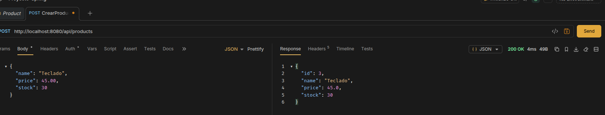

---

### 8. GET `/api/products` — Lista de productos

Respuesta JSON con los 3 productos registrados en memoria tras las peticiones POST previas (Laptop, Mouse, Teclado).

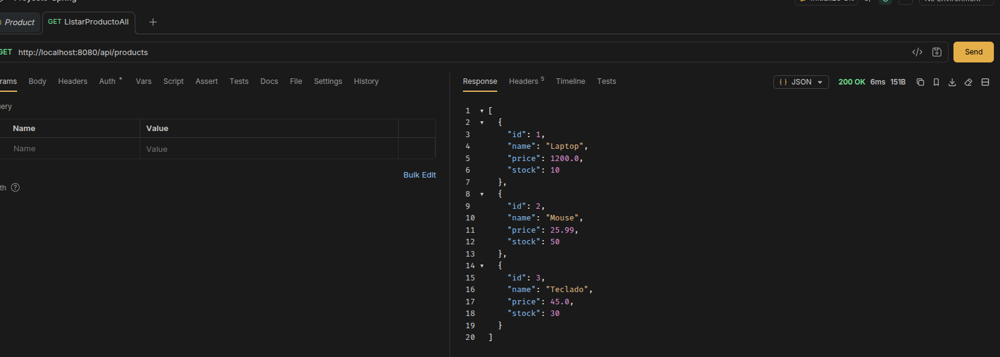

---

### 9. GET `/api/products/{id}` — Producto por id

Respuesta JSON al consultar el producto con id 2 (Mouse). El servidor retorna únicamente los datos del producto solicitado.

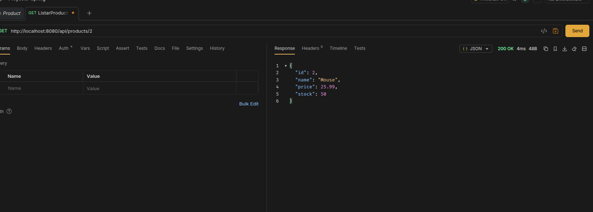

---

### 10. PUT `/api/products/{id}` — Actualización completa

Actualización total del producto con id 1. Se reemplazan todos los campos: el nombre cambia de `Laptop` a `Laptop Gaming`, el precio a `1850.0` y el stock a `5`.

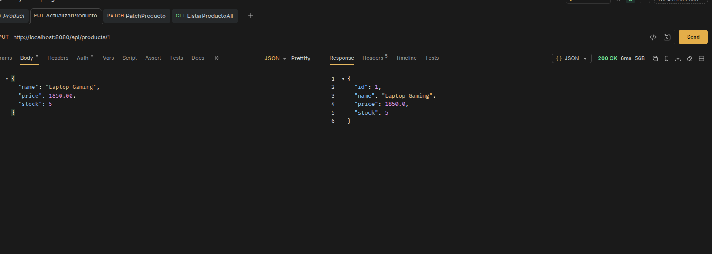

---

### 11. PATCH `/api/products/{id}` — Actualización parcial

Actualización parcial del producto con id 3. Solo se envía el campo `price` con el valor `39.99`. El nombre y el stock permanecen sin cambios.

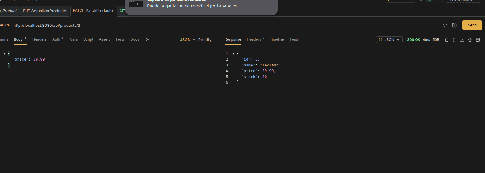

---

### 12. GET `/api/products` — Lista tras modificaciones

Lista actualizada de productos después de aplicar el PUT y el PATCH. Se confirma que los cambios persisten correctamente en memoria.

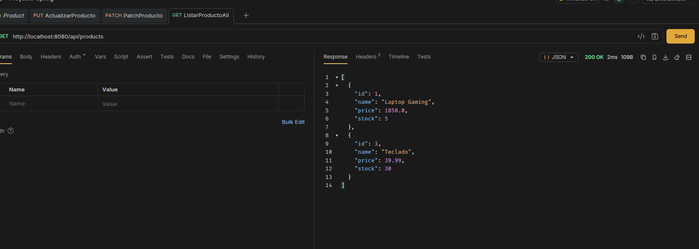

---

### 13. DELETE `/api/products/{id}` — Eliminar producto existente

Eliminación del producto con id 2 (Mouse). El servidor confirma la operación con el mensaje `Deleted successfully`.

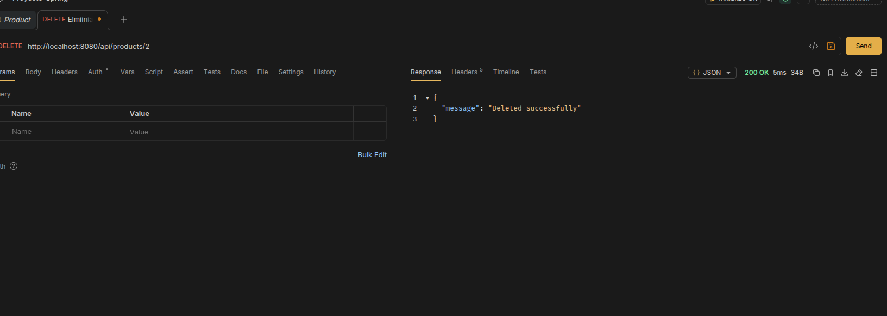

---

### 14. DELETE `/api/products/{id}` — Eliminar producto inexistente

Intento de eliminación de un producto con un id que no existe. El servidor retorna el mensaje de error `Product not found`.

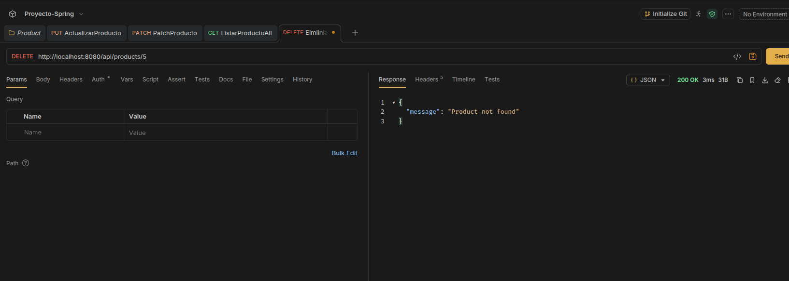

---

## Explicación personal — Práctica 2

### Arquitectura en capas y uso de DTOs

La Práctica 2 introduce una arquitectura en capas donde cada componente tiene una responsabilidad específica. El controlador recibe las peticiones HTTP y las delega al servicio; el servicio contiene la lógica de negocio y accede al repositorio; el repositorio gestiona el almacenamiento en memoria. Los DTOs (Data Transfer Objects) permiten separar los datos que el cliente envía de los datos que el sistema almacena internamente, evitando exponer directamente las entidades del dominio.

### Manejo del timestamp con `LocalDateTime.now()`

Uno de los aspectos relevantes de la práctica es el control del campo `createdAt`. Aunque el DTO de creación (`CreateProductDto`) podría recibir una fecha enviada por el cliente, el backend la ignora intencionalmente. En su lugar, el mapper asigna la fecha en el momento exacto en que se procesa la petición:

```java
// ProductMapper.java
model.setCreatedAt(LocalDateTime.now());
```

Esto garantiza que la fecha de creación siempre sea generada por el servidor y no pueda ser manipulada externamente. Adicionalmente, el campo `createdAt` no se incluye en la respuesta (`ProductResponseDto`), lo que evita exponer información interna innecesaria al cliente.

### Generación del id con contador en memoria

Dado que el proyecto no utiliza base de datos, el id de cada producto se genera mediante un contador definido en el servicio. Cada vez que se crea un producto, el servicio asigna el valor actual del contador como id y luego lo incrementa en uno:

```java
// ProductServiceImpl.java
private Long currentId = 1L;

product.setId(currentId);
currentId++;
```

Este mecanismo garantiza que cada producto tenga un identificador único durante la ejecución del servidor, aunque los datos se pierden al reiniciarlo por tratarse de almacenamiento en memoria.

---

# Práctica 3 — Persistencia con PostgreSQL y Docker

## Objetivo

Reemplazar el almacenamiento en memoria por una base de datos real (PostgreSQL), conectada a Spring Boot mediante JPA e Hibernate, y levantada a través de un contenedor Docker.

---

## 1. Dependencias agregadas

Se añadieron dos dependencias en [build.gradle.kts](build.gradle.kts):

```kotlin
implementation("org.springframework.boot:spring-boot-starter-data-jpa")
runtimeOnly("org.postgresql:postgresql")
testImplementation("org.springframework.boot:spring-boot-starter-data-jpa-test")
```

| Dependencia                        | Función                                          |
|------------------------------------|--------------------------------------------------|
| `spring-boot-starter-data-jpa`     | Habilita JPA, Hibernate y repositorios           |
| `postgresql`                       | Driver para conectar Spring Boot con PostgreSQL  |
| `spring-boot-starter-data-jpa-test`| Soporte de JPA en pruebas                        |

---

## 2. Configuración de la conexión en `application.yml`

Se actualizó [application.yml](src/main/resources/application.yml) con los datos de conexión a PostgreSQL:

```yaml
spring:
  datasource:
    url: jdbc:postgresql://localhost:5433/devdb
    username: ups
    password: ups123
  jpa:
    hibernate:
      ddl-auto: update
    properties:
      hibernate:
        format_sql: true
        dialect: org.hibernate.dialect.PostgreSQLDialect
```

El puerto utilizado es `5433` porque el puerto `5432` está ocupado por una instalación nativa de PostgreSQL en el mismo equipo. El contenedor Docker mapea internamente el puerto `5432` al `5433` del host.

| Propiedad           | Valor                                                      |
|---------------------|------------------------------------------------------------|
| `ddl-auto: update`  | Hibernate crea o actualiza las tablas automáticamente      |
| `format_sql: true`  | Muestra el SQL generado de forma legible en consola        |
| `dialect`           | Indica a Hibernate que genere SQL compatible con PostgreSQL |

---

## 3. Configuración de Docker

### 3.1. Agregar el usuario al grupo docker

Para ejecutar Docker sin `sudo`:

```bash
sudo usermod -aG docker $USER
newgrp docker
```

### 3.2. Crear y levantar el contenedor PostgreSQL

```bash
docker run -d \
  --name postgres-dev \
  -e POSTGRES_USER=ups \
  -e POSTGRES_PASSWORD=ups123 \
  -e POSTGRES_DB=devdb \
  -p 5433:5432 \
  postgres:16
```

| Parámetro              | Valor       |
|------------------------|-------------|
| Nombre del contenedor  | postgres-dev |
| Usuario                | ups         |
| Contraseña             | ups123      |
| Base de datos          | devdb       |
| Puerto en el host      | 5433        |

### 3.3. Verificar que el contenedor está activo

```bash
docker ps
```

Resultado esperado:

```
CONTAINER ID   IMAGE         PORTS                     NAMES
f7377d627714   postgres:16   0.0.0.0:5433->5432/tcp    postgres-dev
```

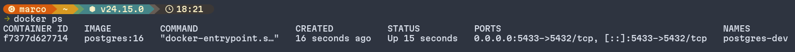

---

## 4. Verificación de la conexión desde Spring Boot

Al ejecutar `./gradlew bootRun` con el contenedor activo, la consola debe mostrar que Hibernate inicializó correctamente:

```
HikariPool-1 - Start completed
Hibernate: create table if not exists users (...)
```

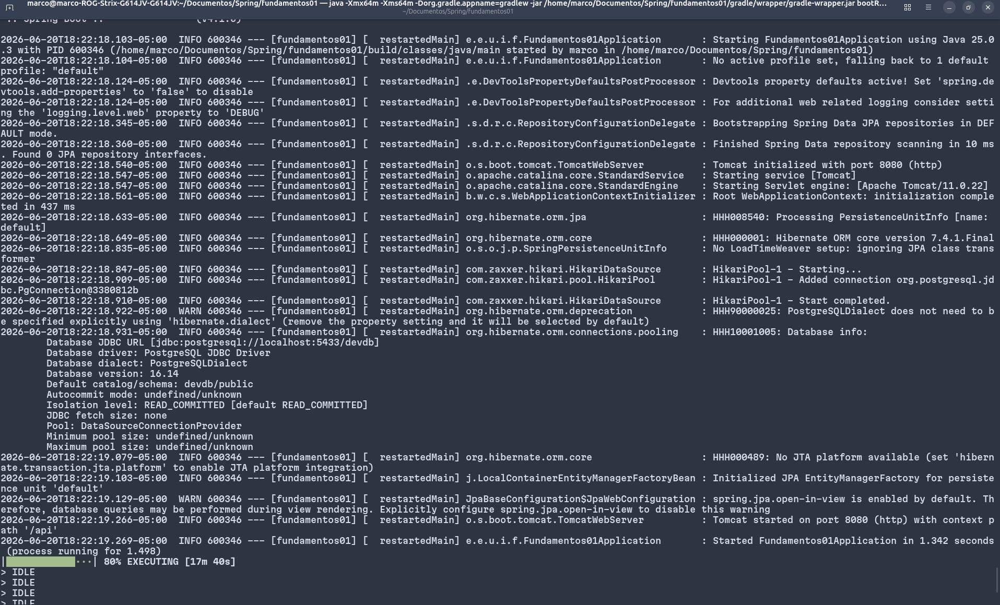

---

## 5. Estructura del proyecto — Práctica 3

```
fundamentos01/
└── src/main/java/ec/edu/ups/icc/fundamentos01/
    ├── core/
    │   └── entities/
    │       └── BaseEntity.java
    ├── users/
    │   ├── controllers/
    │   │   └── UserController.java
    │   ├── dtos/
    │   ├── entities/
    │   │   └── UserEntity.java
    │   ├── mappers/
    │   │   └── UserMapper.java
    │   ├── models/
    │   │   └── UserModel.java
    │   ├── repositories/
    │   │   └── UserRepository.java
    │   └── services/
    │       ├── UserService.java
    │       └── UserServiceImpl.java
    └── products/
        ├── controllers/
        │   └── ProductController.java
        ├── dtos/
        ├── entities/
        │   └── ProductEntity.java
        ├── mappers/
        │   └── ProductMapper.java
        ├── models/
        │   └── ProductModel.java
        ├── repositories/
        │   └── ProductRepository.java
        └── services/
            ├── ProductService.java
            └── ProductServiceImpl.java
```

---

## 6. Superclase `BaseEntity`

Se creó una clase base que centraliza los campos comunes de todas las entidades: `id`, `createdAt`, `updatedAt` y `deleted`.

Archivo: [core/entities/BaseEntity.java](src/main/java/ec/edu/ups/icc/fundamentos01/core/entities/BaseEntity.java)

```java
@MappedSuperclass
public abstract class BaseEntity {

    @Id
    @GeneratedValue(strategy = GenerationType.IDENTITY)
    private Long id;

    private LocalDateTime createdAt;
    private LocalDateTime updatedAt;
    private boolean deleted;

    @PrePersist
    protected void onCreate() {
        this.deleted = false;
        this.createdAt = LocalDateTime.now();
    }

    @PreUpdate
    protected void onUpdate() {
        this.updatedAt = LocalDateTime.now();
    }
}
```

| Anotación           | Función                                             |
|---------------------|-----------------------------------------------------|
| `@MappedSuperclass` | Las entidades hijas heredan los atributos           |
| `@Id`               | Marca el identificador principal                    |
| `@GeneratedValue`   | El ID es generado automáticamente por la base de datos |
| `@PrePersist`       | Asigna `createdAt` y `deleted` antes de insertar   |
| `@PreUpdate`        | Asigna `updatedAt` antes de actualizar             |

---

## 7. Entidades JPA

Las entidades extienden `BaseEntity` y representan las tablas en PostgreSQL.

### `UserEntity`

```java
@Entity
@Table(name = "users")
public class UserEntity extends BaseEntity {

    @Column(nullable = false, length = 150)
    private String name;

    @Column(nullable = false, unique = true, length = 150)
    private String email;

    @Column(nullable = false)
    private String passwordHash;
}
```

### `ProductEntity`

```java
@Entity
@Table(name = "products")
public class ProductEntity extends BaseEntity {

    @Column(nullable = false, length = 150)
    private String name;

    @Column(nullable = false)
    private Double price;

    @Column(nullable = false)
    private Integer stock;
}
```

---

## 8. Repositorios JPA

Los repositorios reemplazan completamente las listas en memoria. Al extender `JpaRepository`, Spring Data JPA provee automáticamente los métodos `save`, `findById`, `findAll`, `delete`, entre otros.

### `UserRepository`

```java
@Repository
public interface UserRepository extends JpaRepository<UserEntity, Long> {
    Optional<UserEntity> findByEmail(String email);
}
```

### `ProductRepository`

```java
@Repository
public interface ProductRepository extends JpaRepository<ProductEntity, Long> {
}
```

---

## 9. Actualización de los mappers

Se agregaron métodos para convertir entre entidades y modelos.

| Método               | Conversión                          |
|----------------------|-------------------------------------|
| `toModelFromDTO`     | `CreateDto` → `Model`               |
| `toModelFromEntity`  | `Entity` → `Model`                  |
| `toEntityFromModel`  | `Model` → `Entity`                  |
| `toResponse`         | `Model` → `ResponseDto`             |

Ejemplo en `UserMapper`:

```java
public static UserModel toModelFromEntity(UserEntity entity) {
    UserModel model = new UserModel();
    model.setId(entity.getId());
    model.setName(entity.getName());
    model.setEmail(entity.getEmail());
    model.setPasswordHash(entity.getPasswordHash());
    model.setCreatedAt(entity.getCreatedAt());
    model.setUpdatedAt(entity.getUpdatedAt());
    model.setDeleted(entity.isDeleted());
    return model;
}
```

---

## 10. Actualización de los servicios

### Cambios en la interfaz

Los métodos ya no retornan `Object`. El método `delete` ahora retorna `void`.

```java
public interface UserService {
    List<UserResponseDto> findAll();
    UserResponseDto findOne(Long id);
    UserResponseDto create(CreateUserDto dto);
    UserResponseDto update(Long id, UpdateUserDto dto);
    UserResponseDto partialUpdate(Long id, PartialUpdateUserDto dto);
    void delete(Long id);
}
```

### Cambios en la implementación

Se eliminó la lista en memoria y el contador manual de IDs:

```java
// Eliminado:
private List<UserModel> users = new ArrayList<>();
private Long currentId = 1L;

// Reemplazado por:
private final UserRepository userRepository;
```

El flujo de creación ahora sigue la cadena completa:

```java
UserModel model = UserMapper.toModelFormDTO(dto);
UserEntity entity = UserMapper.toEntityFromModel(model);
UserEntity savedEntity = userRepository.save(entity);
UserModel savedModel = UserMapper.toModelFromEntity(savedEntity);
return UserMapper.toResponse(savedModel);
```

### Eliminación lógica

El método `delete` ya no elimina el registro de la base de datos. En su lugar, marca el campo `deleted = true`:

```java
entity.setDeleted(true);
userRepository.save(entity);
```

---

## Evidencias — Práctica 3

### 15. Contenedor Docker en ejecución

Salida del comando `docker ps` confirmando que el contenedor `postgres-dev` está activo en el puerto `5433` del host.


---

### 16. Arranque de Spring Boot con PostgreSQL

Consola del comando `./gradlew bootRun` mostrando que Hibernate detectó los repositorios JPA, estableció el pool de conexiones (`HikariPool-1 - Start completed`) y que Tomcat inició correctamente en el puerto `8080`.


---

### 17. POST `/api/products` — Crear producto persistido

Creación del quinto producto ("Audifonos Sony") mediante una petición POST. El servidor retorna el objeto con el `id: 5` asignado por PostgreSQL mediante `IDENTITY`, confirmando que el dato fue almacenado en la base de datos.

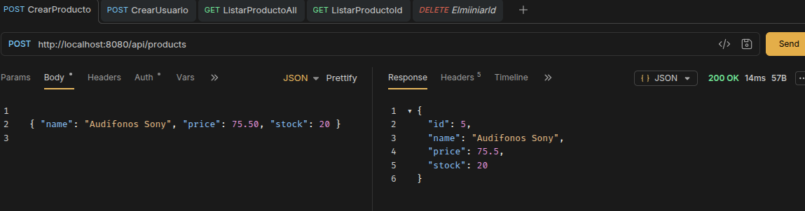

---

### 18. GET `/api/products` — Lista completa desde PostgreSQL

Listado de los cinco productos creados durante las pruebas. Los datos provienen directamente de la tabla `products` en PostgreSQL, no de memoria.

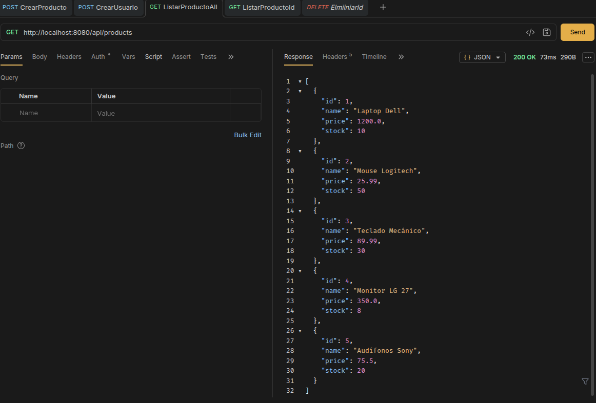

---

### 19. GET `/api/products/{id}` — Consulta de producto por id

Consulta del producto con `id: 2` (Mouse Logitech). El servidor recupera el registro desde PostgreSQL y retorna únicamente los campos expuestos en el DTO de respuesta.

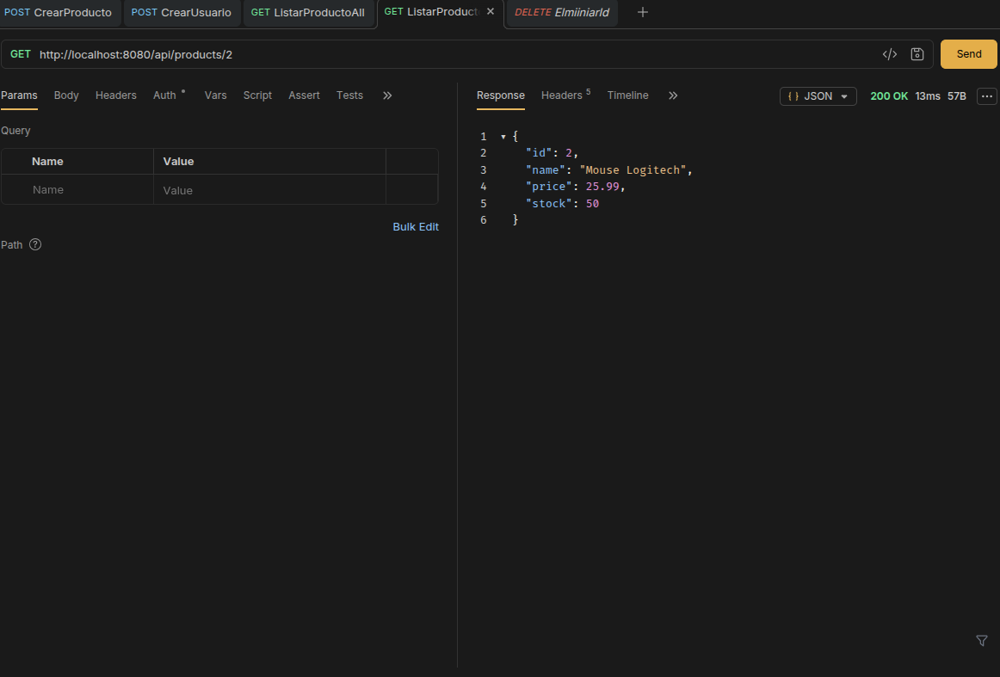

---

### 20. POST `/api/users` — Crear usuario persistido

Creación del tercer usuario ("Ana Torres") mediante una petición POST. El `id: 3` es asignado por PostgreSQL, y la contraseña no se devuelve en la respuesta por estar excluida del `UserResponseDto`.

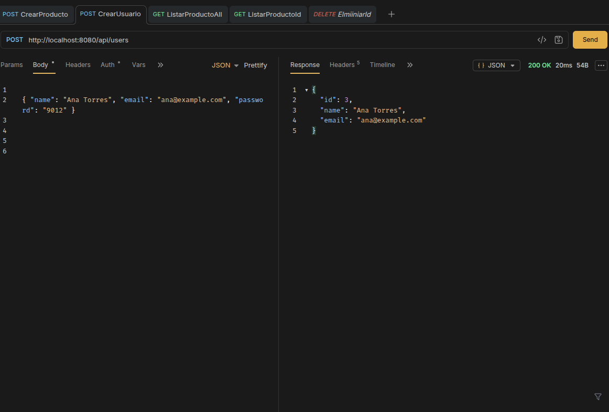

---

### 21. GET `/api/users/{id}` — Consulta de usuario por id

Consulta del usuario con `id: 1` (Marco Cobos). El servidor recupera el registro desde la tabla `users` y retorna los campos `id`, `name` y `email`.

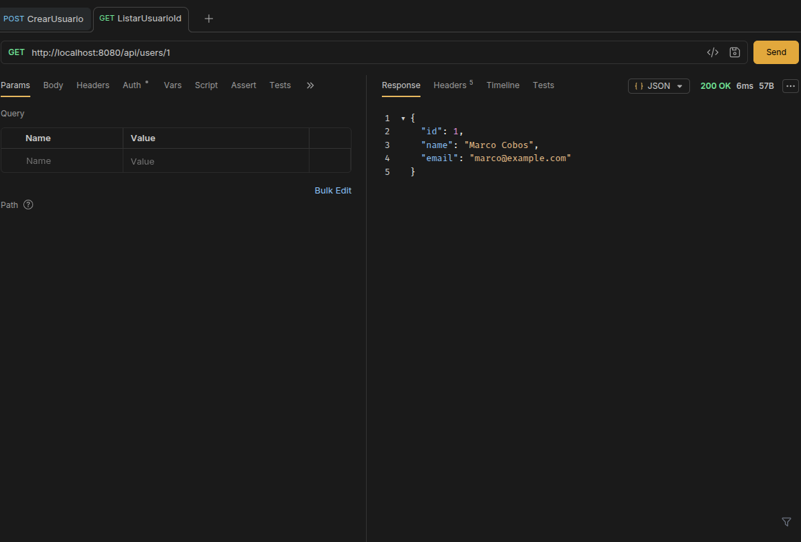

---

### 22. GET `/api/users` — Lista completa de usuarios

Listado de los tres usuarios registrados (Marco Cobos, Juan Pérez, Ana Torres). Se confirma que todos los registros persisten correctamente en PostgreSQL entre peticiones.

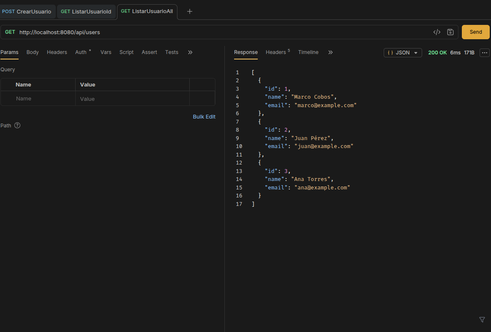

---

## Explicación personal — Práctica 3

### Base de datos PostgreSQL con Docker

Hasta la Práctica 2, los datos se almacenaban en listas que vivían únicamente mientras el servidor estaba en ejecución: al detenerlo, todo se perdía. En la Práctica 3 se introdujo PostgreSQL como base de datos relacional, lo que permite que los registros de productos y usuarios persistan de forma permanente entre reinicios del servidor.

Para levantar PostgreSQL sin interferir con la instalación nativa del sistema (que ya ocupaba el puerto `5432`), se utilizó Docker. Docker permite ejecutar PostgreSQL en un contenedor aislado, como si fuera un proceso independiente del sistema operativo. El contenedor se configuró con el puerto `5433` en el host apuntando al puerto `5432` interno del contenedor, evitando conflictos. Esto resulta especialmente conveniente en entornos de desarrollo, ya que el contenedor puede iniciarse y detenerse con un solo comando sin afectar al resto del sistema.

### JPA e Hibernate como puente entre Java y la base de datos

La conexión entre Spring Boot y PostgreSQL se establece a través de JPA (Java Persistence API) e Hibernate. JPA es una especificación que define cómo deben mapearse los objetos Java a tablas relacionales; Hibernate es la implementación que Spring Boot utiliza por defecto para cumplir esa especificación.

Con la anotación `@Entity`, una clase Java queda vinculada a una tabla en la base de datos. Con `@GeneratedValue(strategy = GenerationType.IDENTITY)`, se delega en PostgreSQL la responsabilidad de generar el `id` de forma automática e incremental, eliminando la necesidad del contador manual que se usaba en la Práctica 2. Los callbacks `@PrePersist` y `@PreUpdate` en `BaseEntity` permiten que campos como `createdAt` y `updatedAt` sean asignados automáticamente por Hibernate en el momento en que se ejecuta la operación, sin intervención del desarrollador.

La propiedad `ddl-auto: update` instruye a Hibernate para que cree o actualice las tablas al arrancar la aplicación si no existen o si su estructura cambió, lo que simplifica enormemente el ciclo de desarrollo.

---

---

# Autor

| Campo       | Detalle                  |
|-------------|--------------------------|
| Nombre      | Marco Cobos              |
| Correo      | marcocobos15@gmail.com   |
| Fecha       | Junio 2026               |
