# Fundamentos Spring Boot — Laboratorio 01

**Asignatura:** Programación y Plataformas Web  
**Institución:** Universidad Politécnica Salesiana  
**Carrera:** Ingeniería de Sistemas  
**Grupo:** ec.edu.ups.icc  
**Versión del proyecto:** 0.0.1-SNAPSHOT  

---

## Índice

- [Descripción general](#descripción-general)
- [Tecnologías utilizadas](#tecnologías-utilizadas)
- [Configuración del servidor](#configuración-del-servidor)
- [Ejecución del proyecto](#ejecución-del-proyecto)
- [Práctica 1 — Servidor y endpoints básicos](#práctica-1--servidor-y-endpoints-básicos)
- [Práctica 2 — CRUD de productos y usuarios](#práctica-2--crud-de-productos-y-usuarios)
- [Práctica 3 — Persistencia con PostgreSQL y Docker](#práctica-3--persistencia-con-postgresql-y-docker)
- [Práctica 6 — Validación de DTOs y control de datos de entrada](#práctica-6--validación-de-dtos-y-control-de-datos-de-entrada)
- [Práctica 14 — Refresh Token con JWT](#práctica-14--refresh-token-con-jwt)
- [Práctica 15 — Despliegue en Producción](#práctica-15--despliegue-en-producción)
- [Autor](#autor)

---

## Descripción general

Este repositorio agrupa las prácticas del primer laboratorio de la asignatura de Programación y Plataformas Web. Cada práctica amplía el proyecto con nuevas funcionalidades sobre el mismo servidor Spring Boot, el cual expone una API REST bajo el prefijo `/api`.

---

## Tecnologías utilizadas

| Tecnología        | Versión     |
|-------------------|-------------|
| Java              | 25          |
| Spring Boot       | 4.1.0       |
| Gradle (Kotlin)   | --          |
| Spring Web MVC    | (incluido)  |
| JUnit Platform    | (incluido)  |

---

## Configuración del servidor

El archivo `application.yml` define el puerto y el prefijo base de la API:

```yaml
server:
  port: 8080
  servlet:
    context-path: /api

spring:
  application:
    name: fundamentos01
```

Todos los endpoints quedan bajo el prefijo `/api`.

---

## Ejecución del proyecto

```bash
./gradlew bootRun
```

---

# Práctica 1 — Servidor y endpoints básicos

## Objetivo

Verificar la correcta configuración del entorno de desarrollo y demostrar el funcionamiento básico de un servidor web embebido mediante la exposición de endpoints REST de estado y listado de estudiantes.

---

## Estructura del proyecto — Práctica 1

```
fundamentos01/
├── src/main/java/ec/edu/ups/icc/fundamentos01/
│   ├── Fundamentos01Application.java
│   ├── core/
│   │   └── controllers/
│   │       └── StatusController.java
│   └── students/
│       ├── controllers/
│       │   └── StudentController.java
│       └── models/
│           └── Student.java
└── src/main/resources/
    └── application.yml
```

---

## Endpoints — Práctica 1

| Método | Ruta                  | Descripción                           |
|--------|-----------------------|---------------------------------------|
| GET    | `/api/status`         | Retorna el estado actual del servidor |
| GET    | `/api/students`       | Retorna la lista de estudiantes       |
| GET    | `/api/students/count` | Retorna el total de estudiantes       |

**Ejemplo de respuesta — `/api/status`:**

```json
{
  "status": "running",
  "service": "Spring Boot API",
  "timestamp": "2026-06-18T14:52:59.860601512"
}
```

**Ejemplo de respuesta — `/api/students`:**

```json
[
  { "id": 1, "name": "Juan", "age": 30 },
  { "id": 2, "name": "Diego", "age": 10 }
]
```

---

## Evidencias — Práctica 1

### 1. Verificación de la versión de Java

Salida del comando `java -version` en terminal, confirmando que el entorno cumple con el requisito de Java 25.


---

### 2. Servidor Spring Boot en ejecución

Salida de la consola al iniciar la aplicación, donde se observa el banner de Spring Boot y la confirmación de que Tomcat inició en el puerto 8080.


---

### 3. Endpoint `/api/status` funcionando

Respuesta JSON obtenida al acceder a `http://localhost:8080/api/status` desde el navegador.


---

### 4. Listado de controladores en terminal

Salida del siguiente comando ejecutado desde la raíz del proyecto:

```bash
ls ./src/main/java/ec/edu/ups/icc/fundamentos01/controllers/
```

Resultado esperado:

```
StatusController.java
```

---

### 5. Endpoint `/api/students` funcionando

Respuesta JSON con la lista de estudiantes registrados en memoria.


---

### 6. Endpoint `/api/students/count` funcionando

Respuesta con el total de estudiantes registrados.


---

## Explicación personal — Práctica 1

### Funcionamiento del endpoint `/api/status`

El endpoint `/api/status` representa el punto de entrada más básico de la API construida con Spring Boot. Al recibir una solicitud HTTP de tipo GET en esa ruta, el método `status()` del controlador `StatusController` es invocado automáticamente por el framework. Este método retorna un mapa de clave-valor que Spring convierte en formato JSON antes de enviar la respuesta al cliente. Los campos retornados incluyen el nombre del servicio, su estado actual y la marca de tiempo del momento exacto en que se procesó la solicitud, lo que permite verificar que el servidor se encuentra activo y respondiendo correctamente.

### Función general de Spring Boot en la creación del servidor

Spring Boot simplifica el proceso de configuración y puesta en marcha de aplicaciones Java al proporcionar un servidor web embebido (Apache Tomcat) que se inicia junto con la aplicación, eliminando la necesidad de desplegar el proyecto en un servidor externo. La anotación `@SpringBootApplication` activa la configuración automática del contexto de aplicación, lo que permite que Spring detecte y registre los controladores REST de forma automática. Gracias a este enfoque, el desarrollador puede concentrarse en la lógica del negocio en lugar de gestionar manualmente la infraestructura del servidor.

---

# Práctica 2 — CRUD de productos y usuarios

## Objetivo

Implementar operaciones CRUD completas (Create, Read, Update, Delete) sobre dos recursos — productos y usuarios — aplicando una arquitectura en capas con controladores, servicios, repositorios, entidades y DTOs.

---

## Estructura del proyecto — Práctica 2

```
fundamentos01/
└── src/main/java/ec/edu/ups/icc/fundamentos01/
    ├── products/
    │   ├── controllers/
    │   │   └── ProductController.java
    │   ├── dtos/
    │   │   ├── CreateProductDto.java
    │   │   ├── UpdateProductDto.java
    │   │   ├── PartialUpdateProductDto.java
    │   │   └── ProductResponseDto.java
    │   ├── entities/
    │   │   └── ProductEntity.java
    │   ├── mappers/
    │   │   └── ProductMapper.java
    │   ├── models/
    │   │   └── ProductModel.java
    │   ├── repositories/
    │   │   └── ProductRepository.java
    │   └── services/
    │       ├── ProductService.java
    │       └── ProductServiceImpl.java
    └── users/
        ├── controllers/
        │   └── UserController.java
        ├── dtos/
        │   ├── CreateUserDto.java
        │   ├── UpdateUserDto.java
        │   ├── PartialUpdateUserDto.java
        │   └── UserResponseDto.java
        ├── entities/
        │   └── UserEntity.java
        ├── mappers/
        │   └── UserMapper.java
        ├── models/
        │   └── UserModel.java
        ├── repositories/
        │   └── UserRepository.java
        └── services/
            ├── UserService.java
            └── UserServiceImpl.java
```

---

## Endpoints — Práctica 2

### Productos

| Método | Ruta                  | Descripción                              |
|--------|-----------------------|------------------------------------------|
| GET    | `/api/products`       | Retorna la lista de todos los productos  |
| GET    | `/api/products/{id}`  | Retorna un producto por su id            |
| POST   | `/api/products`       | Crea un nuevo producto                   |
| PUT    | `/api/products/{id}`  | Actualiza completamente un producto      |
| PATCH  | `/api/products/{id}`  | Actualiza parcialmente un producto       |
| DELETE | `/api/products/{id}`  | Elimina un producto por su id            |

### Usuarios

| Método | Ruta               | Descripción                            |
|--------|--------------------|----------------------------------------|
| GET    | `/api/users`       | Retorna la lista de todos los usuarios |
| GET    | `/api/users/{id}`  | Retorna un usuario por su id           |
| POST   | `/api/users`       | Crea un nuevo usuario                  |
| PUT    | `/api/users/{id}`  | Actualiza completamente un usuario     |
| PATCH  | `/api/users/{id}`  | Actualiza parcialmente un usuario      |
| DELETE | `/api/users/{id}`  | Elimina un usuario por su id           |

---

## Evidencias — Práctica 2

### 7. POST `/api/products` — Crear producto

Creación de un nuevo producto enviando `name`, `price` y `stock` en el cuerpo de la petición. El servidor retorna el producto creado con su id asignado.


---

### 8. GET `/api/products` — Lista de productos

Respuesta JSON con los 3 productos registrados en memoria tras las peticiones POST previas (Laptop, Mouse, Teclado).


---

### 9. GET `/api/products/{id}` — Producto por id

Respuesta JSON al consultar el producto con id 2 (Mouse). El servidor retorna únicamente los datos del producto solicitado.


---

### 10. PUT `/api/products/{id}` — Actualización completa

Actualización total del producto con id 1. Se reemplazan todos los campos: el nombre cambia de `Laptop` a `Laptop Gaming`, el precio a `1850.0` y el stock a `5`.


---

### 11. PATCH `/api/products/{id}` — Actualización parcial

Actualización parcial del producto con id 3. Solo se envía el campo `price` con el valor `39.99`. El nombre y el stock permanecen sin cambios.


---

### 12. GET `/api/products` — Lista tras modificaciones

Lista actualizada de productos después de aplicar el PUT y el PATCH. Se confirma que los cambios persisten correctamente en memoria.


---

### 13. DELETE `/api/products/{id}` — Eliminar producto existente

Eliminación del producto con id 2 (Mouse). El servidor confirma la operación con el mensaje `Deleted successfully`.


---

### 14. DELETE `/api/products/{id}` — Eliminar producto inexistente

Intento de eliminación de un producto con un id que no existe. El servidor retorna el mensaje de error `Product not found`.


---

## Explicación personal — Práctica 2

### Arquitectura en capas y uso de DTOs

La Práctica 2 introduce una arquitectura en capas donde cada componente tiene una responsabilidad específica. El controlador recibe las peticiones HTTP y las delega al servicio; el servicio contiene la lógica de negocio y accede al repositorio; el repositorio gestiona el almacenamiento en memoria. Los DTOs (Data Transfer Objects) permiten separar los datos que el cliente envía de los datos que el sistema almacena internamente, evitando exponer directamente las entidades del dominio.

### Manejo del timestamp con `LocalDateTime.now()`

Uno de los aspectos relevantes de la práctica es el control del campo `createdAt`. Aunque el DTO de creación (`CreateProductDto`) podría recibir una fecha enviada por el cliente, el backend la ignora intencionalmente. En su lugar, el mapper asigna la fecha en el momento exacto en que se procesa la petición:

```java
// ProductMapper.java
model.setCreatedAt(LocalDateTime.now());
```

Esto garantiza que la fecha de creación siempre sea generada por el servidor y no pueda ser manipulada externamente. Adicionalmente, el campo `createdAt` no se incluye en la respuesta (`ProductResponseDto`), lo que evita exponer información interna innecesaria al cliente.

### Generación del id con contador en memoria

Dado que el proyecto no utiliza base de datos, el id de cada producto se genera mediante un contador definido en el servicio. Cada vez que se crea un producto, el servicio asigna el valor actual del contador como id y luego lo incrementa en uno:

```java
// ProductServiceImpl.java
private Long currentId = 1L;

product.setId(currentId);
currentId++;
```

Este mecanismo garantiza que cada producto tenga un identificador único durante la ejecución del servidor, aunque los datos se pierden al reiniciarlo por tratarse de almacenamiento en memoria.

---

# Práctica 3 — Persistencia con PostgreSQL y Docker

## Objetivo

Reemplazar el almacenamiento en memoria por una base de datos real (PostgreSQL), conectada a Spring Boot mediante JPA e Hibernate, y levantada a través de un contenedor Docker.

---

## 1. Dependencias agregadas

Se añadieron dos dependencias en [build.gradle.kts](build.gradle.kts):

```kotlin
implementation("org.springframework.boot:spring-boot-starter-data-jpa")
runtimeOnly("org.postgresql:postgresql")
testImplementation("org.springframework.boot:spring-boot-starter-data-jpa-test")
```

| Dependencia                        | Función                                          |
|------------------------------------|--------------------------------------------------|
| `spring-boot-starter-data-jpa`     | Habilita JPA, Hibernate y repositorios           |
| `postgresql`                       | Driver para conectar Spring Boot con PostgreSQL  |
| `spring-boot-starter-data-jpa-test`| Soporte de JPA en pruebas                        |

---

## 2. Configuración de la conexión en `application.yml`

Se actualizó [application.yml](src/main/resources/application.yml) con los datos de conexión a PostgreSQL:

```yaml
spring:
  datasource:
    url: jdbc:postgresql://localhost:5433/devdb
    username: ups
    password: ups123
  jpa:
    hibernate:
      ddl-auto: update
    properties:
      hibernate:
        format_sql: true
        dialect: org.hibernate.dialect.PostgreSQLDialect
```

El puerto utilizado es `5433` porque el puerto `5432` está ocupado por una instalación nativa de PostgreSQL en el mismo equipo. El contenedor Docker mapea internamente el puerto `5432` al `5433` del host.

| Propiedad           | Valor                                                      |
|---------------------|------------------------------------------------------------|
| `ddl-auto: update`  | Hibernate crea o actualiza las tablas automáticamente      |
| `format_sql: true`  | Muestra el SQL generado de forma legible en consola        |
| `dialect`           | Indica a Hibernate que genere SQL compatible con PostgreSQL |

---

## 3. Configuración de Docker

### 3.1. Agregar el usuario al grupo docker

Para ejecutar Docker sin `sudo`:

```bash
sudo usermod -aG docker $USER
newgrp docker
```

### 3.2. Crear y levantar el contenedor PostgreSQL

```bash
docker run -d \
  --name postgres-dev \
  -e POSTGRES_USER=ups \
  -e POSTGRES_PASSWORD=ups123 \
  -e POSTGRES_DB=devdb \
  -p 5433:5432 \
  postgres:16
```

| Parámetro              | Valor       |
|------------------------|-------------|
| Nombre del contenedor  | postgres-dev |
| Usuario                | ups         |
| Contraseña             | ups123      |
| Base de datos          | devdb       |
| Puerto en el host      | 5433        |

### 3.3. Verificar que el contenedor está activo

```bash
docker ps
```

Resultado esperado:

```
CONTAINER ID   IMAGE         PORTS                     NAMES
f7377d627714   postgres:16   0.0.0.0:5433->5432/tcp    postgres-dev
```


---

## 4. Verificación de la conexión desde Spring Boot

Al ejecutar `./gradlew bootRun` con el contenedor activo, la consola debe mostrar que Hibernate inicializó correctamente:

```
HikariPool-1 - Start completed
Hibernate: create table if not exists users (...)
```


---

## 5. Estructura del proyecto — Práctica 3

```
fundamentos01/
└── src/main/java/ec/edu/ups/icc/fundamentos01/
    ├── core/
    │   └── entities/
    │       └── BaseEntity.java
    ├── users/
    │   ├── controllers/
    │   │   └── UserController.java
    │   ├── dtos/
    │   ├── entities/
    │   │   └── UserEntity.java
    │   ├── mappers/
    │   │   └── UserMapper.java
    │   ├── models/
    │   │   └── UserModel.java
    │   ├── repositories/
    │   │   └── UserRepository.java
    │   └── services/
    │       ├── UserService.java
    │       └── UserServiceImpl.java
    └── products/
        ├── controllers/
        │   └── ProductController.java
        ├── dtos/
        ├── entities/
        │   └── ProductEntity.java
        ├── mappers/
        │   └── ProductMapper.java
        ├── models/
        │   └── ProductModel.java
        ├── repositories/
        │   └── ProductRepository.java
        └── services/
            ├── ProductService.java
            └── ProductServiceImpl.java
```

---

## 6. Superclase `BaseEntity`

Se creó una clase base que centraliza los campos comunes de todas las entidades: `id`, `createdAt`, `updatedAt` y `deleted`.

Archivo: [core/entities/BaseEntity.java](src/main/java/ec/edu/ups/icc/fundamentos01/core/entities/BaseEntity.java)

```java
@MappedSuperclass
public abstract class BaseEntity {

    @Id
    @GeneratedValue(strategy = GenerationType.IDENTITY)
    private Long id;

    private LocalDateTime createdAt;
    private LocalDateTime updatedAt;
    private boolean deleted;

    @PrePersist
    protected void onCreate() {
        this.deleted = false;
        this.createdAt = LocalDateTime.now();
    }

    @PreUpdate
    protected void onUpdate() {
        this.updatedAt = LocalDateTime.now();
    }
}
```

| Anotación           | Función                                             |
|---------------------|-----------------------------------------------------|
| `@MappedSuperclass` | Las entidades hijas heredan los atributos           |
| `@Id`               | Marca el identificador principal                    |
| `@GeneratedValue`   | El ID es generado automáticamente por la base de datos |
| `@PrePersist`       | Asigna `createdAt` y `deleted` antes de insertar   |
| `@PreUpdate`        | Asigna `updatedAt` antes de actualizar             |

---

## 7. Entidades JPA

Las entidades extienden `BaseEntity` y representan las tablas en PostgreSQL.

### `UserEntity`

```java
@Entity
@Table(name = "users")
public class UserEntity extends BaseEntity {

    @Column(nullable = false, length = 150)
    private String name;

    @Column(nullable = false, unique = true, length = 150)
    private String email;

    @Column(nullable = false)
    private String passwordHash;
}
```

### `ProductEntity`

```java
@Entity
@Table(name = "products")
public class ProductEntity extends BaseEntity {

    @Column(nullable = false, length = 150)
    private String name;

    @Column(nullable = false)
    private Double price;

    @Column(nullable = false)
    private Integer stock;
}
```

---

## 8. Repositorios JPA

Los repositorios reemplazan completamente las listas en memoria. Al extender `JpaRepository`, Spring Data JPA provee automáticamente los métodos `save`, `findById`, `findAll`, `delete`, entre otros.

### `UserRepository`

```java
@Repository
public interface UserRepository extends JpaRepository<UserEntity, Long> {
    Optional<UserEntity> findByEmail(String email);
}
```

### `ProductRepository`

```java
@Repository
public interface ProductRepository extends JpaRepository<ProductEntity, Long> {
}
```

---

## 9. Actualización de los mappers

Se agregaron métodos para convertir entre entidades y modelos.

| Método               | Conversión                          |
|----------------------|-------------------------------------|
| `toModelFromDTO`     | `CreateDto` → `Model`               |
| `toModelFromEntity`  | `Entity` → `Model`                  |
| `toEntityFromModel`  | `Model` → `Entity`                  |
| `toResponse`         | `Model` → `ResponseDto`             |

Ejemplo en `UserMapper`:

```java
public static UserModel toModelFromEntity(UserEntity entity) {
    UserModel model = new UserModel();
    model.setId(entity.getId());
    model.setName(entity.getName());
    model.setEmail(entity.getEmail());
    model.setPasswordHash(entity.getPasswordHash());
    model.setCreatedAt(entity.getCreatedAt());
    model.setUpdatedAt(entity.getUpdatedAt());
    model.setDeleted(entity.isDeleted());
    return model;
}
```

---

## 10. Actualización de los servicios

### Cambios en la interfaz

Los métodos ya no retornan `Object`. El método `delete` ahora retorna `void`.

```java
public interface UserService {
    List<UserResponseDto> findAll();
    UserResponseDto findOne(Long id);
    UserResponseDto create(CreateUserDto dto);
    UserResponseDto update(Long id, UpdateUserDto dto);
    UserResponseDto partialUpdate(Long id, PartialUpdateUserDto dto);
    void delete(Long id);
}
```

### Cambios en la implementación

Se eliminó la lista en memoria y el contador manual de IDs:

```java
// Eliminado:
private List<UserModel> users = new ArrayList<>();
private Long currentId = 1L;

// Reemplazado por:
private final UserRepository userRepository;
```

El flujo de creación ahora sigue la cadena completa:

```java
UserModel model = UserMapper.toModelFormDTO(dto);
UserEntity entity = UserMapper.toEntityFromModel(model);
UserEntity savedEntity = userRepository.save(entity);
UserModel savedModel = UserMapper.toModelFromEntity(savedEntity);
return UserMapper.toResponse(savedModel);
```

### Eliminación lógica

El método `delete` ya no elimina el registro de la base de datos. En su lugar, marca el campo `deleted = true`:

```java
entity.setDeleted(true);
userRepository.save(entity);
```

---

## Evidencias — Práctica 3

### 15. Contenedor Docker en ejecución

Salida del comando `docker ps` confirmando que el contenedor `postgres-dev` está activo en el puerto `5433` del host.


---

### 16. Arranque de Spring Boot con PostgreSQL

Consola del comando `./gradlew bootRun` mostrando que Hibernate detectó los repositorios JPA, estableció el pool de conexiones (`HikariPool-1 - Start completed`) y que Tomcat inició correctamente en el puerto `8080`.


---

### 17. POST `/api/products` — Crear producto persistido

Creación del quinto producto ("Audifonos Sony") mediante una petición POST. El servidor retorna el objeto con el `id: 5` asignado por PostgreSQL mediante `IDENTITY`, confirmando que el dato fue almacenado en la base de datos.


---

### 18. GET `/api/products` — Lista completa desde PostgreSQL

Listado de los cinco productos creados durante las pruebas. Los datos provienen directamente de la tabla `products` en PostgreSQL, no de memoria.


---

### 19. GET `/api/products/{id}` — Consulta de producto por id

Consulta del producto con `id: 2` (Mouse Logitech). El servidor recupera el registro desde PostgreSQL y retorna únicamente los campos expuestos en el DTO de respuesta.


---

### 20. POST `/api/users` — Crear usuario persistido

Creación del tercer usuario ("Ana Torres") mediante una petición POST. El `id: 3` es asignado por PostgreSQL, y la contraseña no se devuelve en la respuesta por estar excluida del `UserResponseDto`.


---

### 21. GET `/api/users/{id}` — Consulta de usuario por id

Consulta del usuario con `id: 1` (Marco Cobos). El servidor recupera el registro desde la tabla `users` y retorna los campos `id`, `name` y `email`.


---

### 22. GET `/api/users` — Lista completa de usuarios

Listado de los tres usuarios registrados (Marco Cobos, Juan Pérez, Ana Torres). Se confirma que todos los registros persisten correctamente en PostgreSQL entre peticiones.


---

## Explicación personal — Práctica 3

### Base de datos PostgreSQL con Docker

Hasta la Práctica 2, los datos se almacenaban en listas que vivían únicamente mientras el servidor estaba en ejecución: al detenerlo, todo se perdía. En la Práctica 3 se introdujo PostgreSQL como base de datos relacional, lo que permite que los registros de productos y usuarios persistan de forma permanente entre reinicios del servidor.

Para levantar PostgreSQL sin interferir con la instalación nativa del sistema (que ya ocupaba el puerto `5432`), se utilizó Docker. Docker permite ejecutar PostgreSQL en un contenedor aislado, como si fuera un proceso independiente del sistema operativo. El contenedor se configuró con el puerto `5433` en el host apuntando al puerto `5432` interno del contenedor, evitando conflictos. Esto resulta especialmente conveniente en entornos de desarrollo, ya que el contenedor puede iniciarse y detenerse con un solo comando sin afectar al resto del sistema.

### JPA e Hibernate como puente entre Java y la base de datos

La conexión entre Spring Boot y PostgreSQL se establece a través de JPA (Java Persistence API) e Hibernate. JPA es una especificación que define cómo deben mapearse los objetos Java a tablas relacionales; Hibernate es la implementación que Spring Boot utiliza por defecto para cumplir esa especificación.

Con la anotación `@Entity`, una clase Java queda vinculada a una tabla en la base de datos. Con `@GeneratedValue(strategy = GenerationType.IDENTITY)`, se delega en PostgreSQL la responsabilidad de generar el `id` de forma automática e incremental, eliminando la necesidad del contador manual que se usaba en la Práctica 2. Los callbacks `@PrePersist` y `@PreUpdate` en `BaseEntity` permiten que campos como `createdAt` y `updatedAt` sean asignados automáticamente por Hibernate en el momento en que se ejecuta la operación, sin intervención del desarrollador.

La propiedad `ddl-auto: update` instruye a Hibernate para que cree o actualice las tablas al arrancar la aplicación si no existen o si su estructura cambió, lo que simplifica enormemente el ciclo de desarrollo.

---

# Práctica 6 — Validación de DTOs y control de datos de entrada

## Objetivo

Agregar validación de datos de entrada usando Jakarta Validation, protegiendo la API antes de que los datos lleguen al servicio o a la base de datos. Se aplican reglas de formato en los DTOs y reglas de negocio en los servicios.

---

## Lo que se implementó

### 1. Validaciones en DTOs de productos

Se agregaron anotaciones de Jakarta Validation en los tres DTOs de entrada del módulo `products`:

| DTO                      | Campo   | Reglas aplicadas                              |
|--------------------------|---------|-----------------------------------------------|
| `CreateProductDto`       | `name`  | `@NotBlank`, `@Size(min=3, max=150)`          |
| `CreateProductDto`       | `price` | `@NotNull`, `@DecimalMin("0.0")`              |
| `CreateProductDto`       | `stock` | `@NotNull`, `@Min(0)`                         |
| `UpdateProductDto`       | todos   | Mismas reglas que Create (todos obligatorios) |
| `PartialUpdateProductDto`| todos   | `@Size`, `@DecimalMin`, `@Min` (sin `@NotNull`) |

La diferencia entre `UpdateProductDto` y `PartialUpdateProductDto` es que en PATCH los campos son opcionales — solo se validan si el cliente los envía.

---

### 2. Activación de `@Valid` en los controladores

Se agregó `@Valid` antes de `@RequestBody` en todos los endpoints que reciben un DTO:

```java
// ProductController.java
@PostMapping
public ProductResponseDto create(@Valid @RequestBody CreateProductDto dto) { ... }

@PutMapping("/{id}")
public ProductResponseDto update(@PathVariable Long id, @Valid @RequestBody UpdateProductDto dto) { ... }

@PatchMapping("/{id}")
public ProductResponseDto partialUpdate(@PathVariable Long id, @Valid @RequestBody PartialUpdateProductDto dto) { ... }
```

Sin `@Valid`, Spring ignoraría completamente las anotaciones del DTO y los datos inválidos pasarían al servicio sin ser verificados.

---

### 3. Modelo de dominio con factory methods

Se refactorizó `ProductModel` para que el dominio sepa construirse y convertirse sin depender del mapper externo:

| Método                        | Descripción                                      |
|-------------------------------|--------------------------------------------------|
| `ProductModel.fromDto(dto)`   | Construye el modelo desde un `CreateProductDto`  |
| `ProductModel.fromEntity(e)`  | Construye el modelo desde una `ProductEntity`    |
| `model.toEntity()`            | Convierte el modelo a `ProductEntity`            |
| `model.toResponseDto()`       | Convierte el modelo a `ProductResponseDto`       |
| `model.update(dto)`           | Aplica los cambios de un `UpdateProductDto`      |
| `model.partialUpdate(dto)`    | Aplica solo los campos no nulos del DTO          |

---

### 4. Reglas de negocio en `ProductServiceImpl`

Se implementaron validaciones de negocio que van más allá del formato de los datos:

| Método          | Regla aplicada                                               |
|-----------------|--------------------------------------------------------------|
| `findAll`       | Filtra productos con `deleted = true` — no se devuelven      |
| `findOne`       | Lanza error si el producto existe pero está marcado como eliminado |
| `update`        | Lanza error si se intenta actualizar un producto eliminado   |
| `partialUpdate` | Lanza error si se intenta actualizar un producto eliminado   |
| `delete`        | Lanza error si el producto ya fue eliminado previamente      |

---

### 5. Validación de email duplicado en usuarios

En `UserServiceImpl.create` se agregó una validación de negocio que impide registrar dos usuarios con el mismo email:

```java
if (userRepository.findByEmail(dto.getEmail()).isPresent()) {
    throw new IllegalStateException("Email already registered");
}
```

---

## Evidencias — Práctica 6

### 23. POST `/api/products` — precio negativo rechazado

Petición con `price: -5`. Spring Boot detiene la ejecución antes de llegar al servicio y retorna `400 Bad Request`.

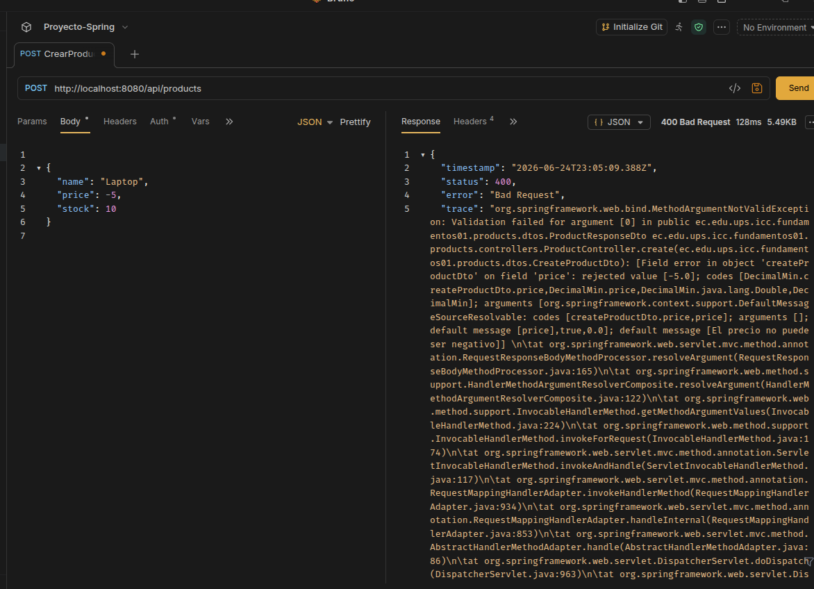

---

### 24. POST `/api/products` — stock negativo rechazado

Petición con `stock: -1`. La anotación `@Min(0)` en el DTO rechaza el valor antes de procesar la petición.

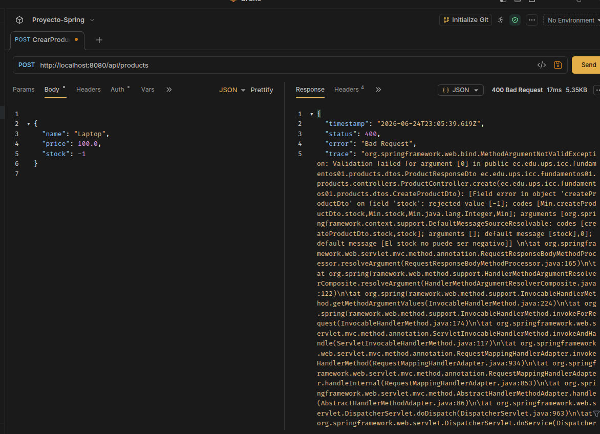

---

### 25. POST `/api/products` — nombre vacío rechazado

Petición con `name: ""`. La anotación `@NotBlank` impide que un nombre vacío llegue al servicio.

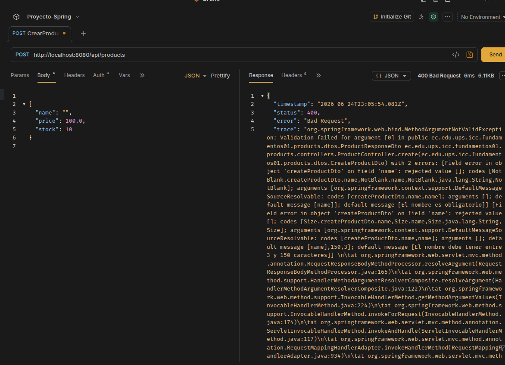

---

### 26. POST `/api/products` — nombre muy corto rechazado

Petición con `name: "A"`. La anotación `@Size(min=3)` rechaza nombres con menos de 3 caracteres.

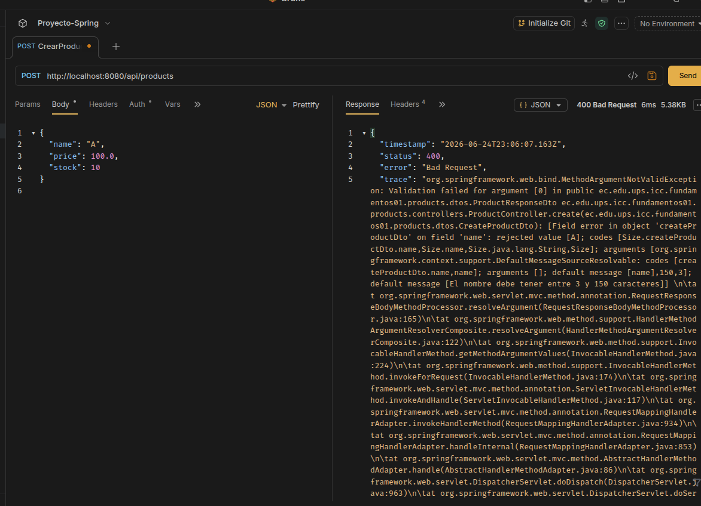

---

### 27. POST `/api/products` — producto válido creado

Petición con datos válidos (`name: "Laptop Dell"`, `price: 1200.0`, `stock: 10`). El servidor retorna `200 OK` con el producto creado y su `id: 3` asignado por PostgreSQL.

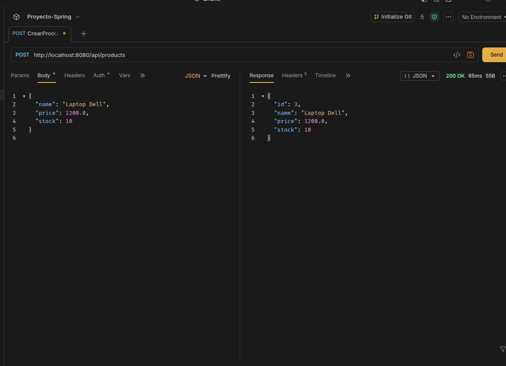

---

### 28. PUT `/api/products/{id}` — error al actualizar producto eliminado

Intento de actualización de un producto que fue eliminado lógicamente. El servicio lanza `IllegalStateException: Cannot update a deleted product` y el servidor retorna un error `500`.

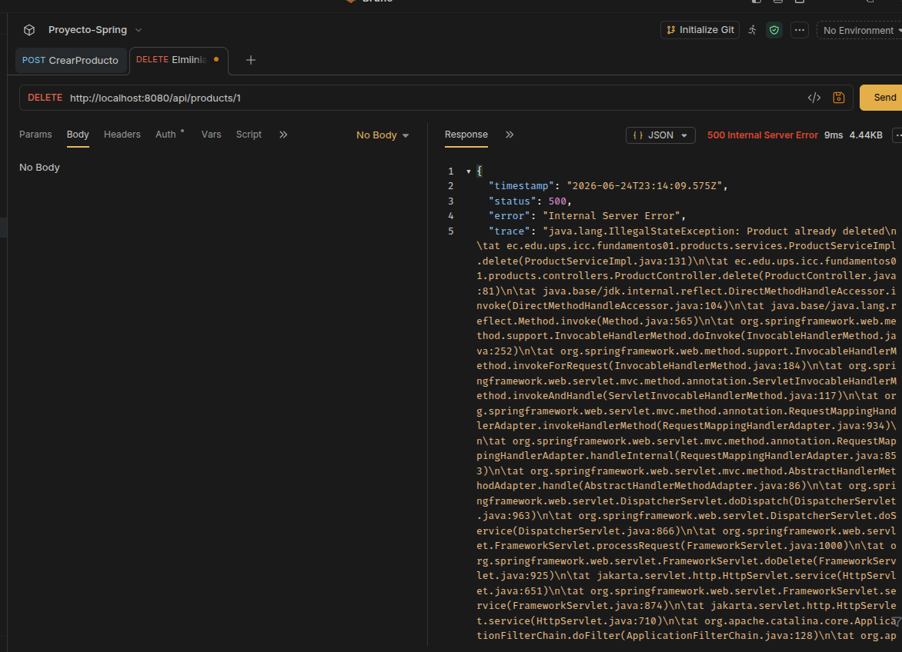

---

### 29. POST `/api/users` — email duplicado rechazado

Intento de registro con un email que ya existe en la base de datos. El servicio lanza `IllegalStateException: Email already registered` antes de intentar guardar en PostgreSQL.

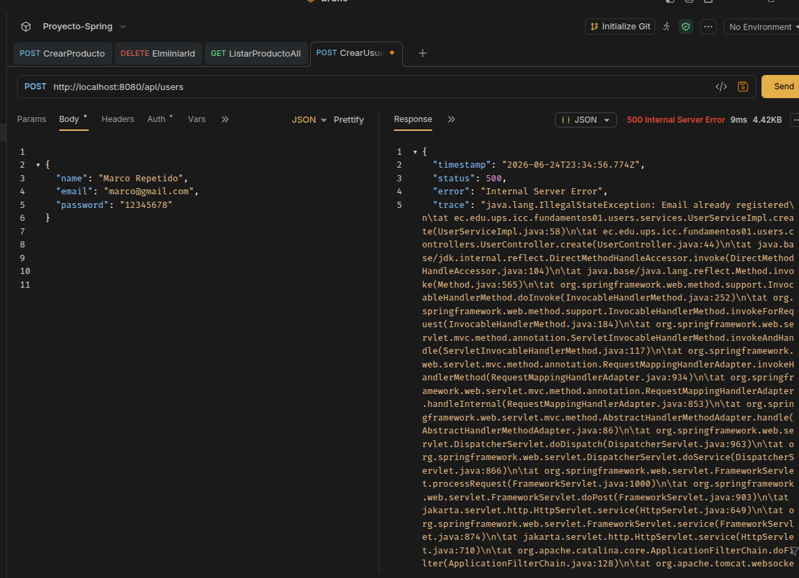

---

### 30. POST `/api/users` — datos inválidos rechazados

Petición con `name: ""`, `email: "correo-invalido"` y `password: "123"`. Spring Boot retorna `400 Bad Request` por las anotaciones `@NotBlank`, `@Email` y `@Size` del `CreateUserDto`.

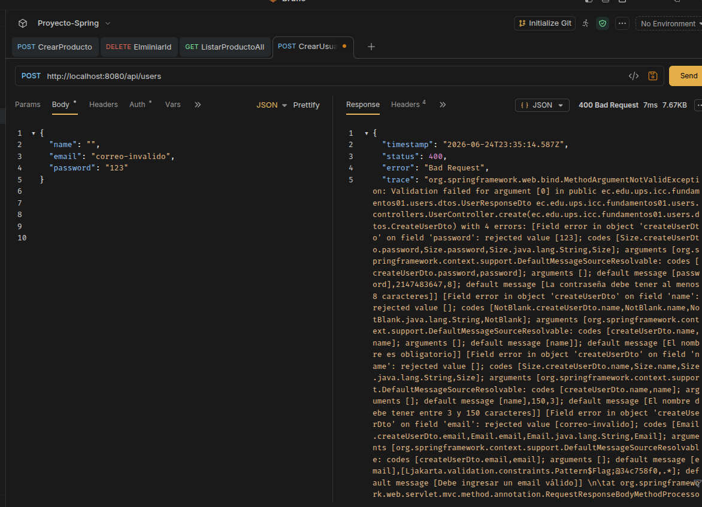

---

### 31. GET `/api/products` — productos eliminados no aparecen

Lista de productos después de haber eliminado algunos registros. El `findAll` filtra los productos con `deleted = true` y solo devuelve los activos (`id: 3`, `id: 4`, `id: 6`).

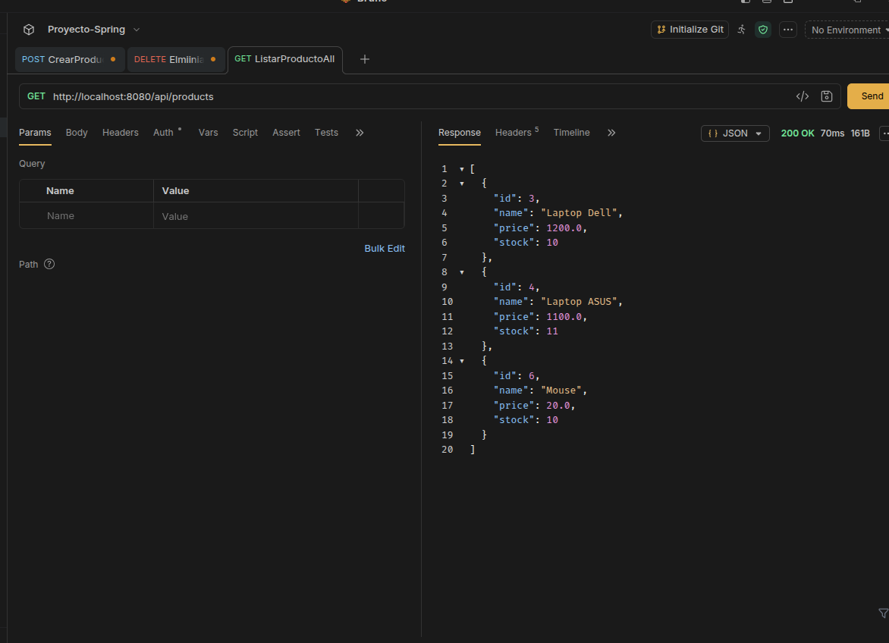

---

## Explicación personal — Práctica 6

### Por qué validar en el DTO y no en el servicio

La validación en el DTO actúa como primera línea de defensa: verifica que los datos tienen el formato correcto antes de que lleguen al servicio. Esto separa responsabilidades — el DTO se encarga del formato, el servicio se encarga de la lógica de negocio. Si se validara todo en el servicio, este acumularía demasiadas responsabilidades y el código sería más difícil de mantener.

### Diferencia entre `@NotBlank` y `@NotNull`

`@NotBlank` aplica únicamente a `String` y rechaza tanto valores `null` como cadenas vacías o con solo espacios. `@NotNull` aplica a cualquier tipo y solo rechaza `null`. Para campos numéricos como `price` y `stock` se usa `@NotNull` combinado con `@DecimalMin` o `@Min`, ya que `@NotBlank` no funciona con `Double` ni `Integer`.

### Eliminación lógica vs eliminación física

En lugar de borrar el registro de la base de datos, el campo `deleted` se marca como `true`. Esto permite mantener el historial de datos, recuperar registros si fuera necesario y evitar problemas de integridad referencial. La API filtra estos registros en `findAll` y rechaza operaciones sobre ellos, haciendo que desde el cliente el producto "no exista", pero el dato se conserva en PostgreSQL.

---

# Práctica 14 — Refresh Token con JWT

## Objetivo

Implementar un mecanismo de renovación de sesión mediante refresh tokens, de modo que el usuario no tenga que volver a iniciar sesión cada vez que expira el access token. Se diferencian ambos tipos de token mediante un claim `type` dentro del JWT, se persiste el refresh token en base de datos para poder revocarlo, y se aplica rotación: cada vez que un refresh token se usa para renovar, ese token queda invalidado y se emite uno nuevo.

---

## Lo que se implementó

### 1. Diferenciación entre access token y refresh token

En `JwtUtil` cada token firmado incluye un claim `type` con el valor `access` o `refresh`. El método centralizado `buildToken(...)` recibe el tiempo de expiración y el tipo, y los métodos públicos quedan especializados:

```java
public String generateAccessToken(Authentication authentication) { ... }
public String generateAccessTokenFromUserDetails(UserDetailsImpl userDetails) { ... }
public String generateRefreshToken(UserDetailsImpl userDetails) { ... }

public boolean validateAccessToken(String token) {
    return validateToken(token) && ACCESS_TOKEN_TYPE.equals(getTokenType(token));
}

public boolean validateRefreshToken(String token) {
    return validateToken(token) && REFRESH_TOKEN_TYPE.equals(getTokenType(token));
}
```

`JwtAuthenticationFilter` ahora exige `validateAccessToken(jwt)` en lugar de `validateToken(jwt)`, de forma que un refresh token enviado en el header `Authorization: Bearer <token>` sea rechazado con `401 Unauthorized`.

---

### 2. Persistencia del refresh token

Se creó la entidad `RefreshTokenEntity` (tabla `refresh_tokens`), que guarda el usuario dueño, el valor del JWT, su fecha de expiración y un indicador `revoked`. Guardarlo en base de datos —y no solo confiar en la expiración interna del JWT— es lo que permite invalidarlo antes de tiempo (logout, rotación).

```java
@Entity
@Table(name = "refresh_tokens")
public class RefreshTokenEntity extends BaseEntity {

    @ManyToOne(fetch = FetchType.LAZY, optional = false)
    @JoinColumn(name = "user_id", nullable = false)
    private UserEntity user;

    @Column(nullable = false, unique = true, length = 1000)
    private String token;

    @Column(nullable = false)
    private LocalDateTime expiresAt;

    @Column(nullable = false)
    private boolean revoked = false;

    public boolean isExpired() {
        return expiresAt.isBefore(LocalDateTime.now());
    }
}
```

`RefreshTokenService` centraliza el ciclo de vida del token: `createRefreshToken`, `validateAndGetActiveToken` (valida firma, tipo, existencia en BD, revocación, expiración y que el usuario siga activo), `revoke` y `revokeAllByUser`.

---

### 3. Rotación de refresh token

Cada vez que se llama a `/auth/refresh`, el refresh token recibido se revoca de inmediato y se genera un par de tokens completamente nuevo. Esto evita que un mismo refresh token pueda reutilizarse indefinidamente:

```java
@Transactional
public AuthResponseDto refresh(RefreshTokenRequestDto request) {
    RefreshTokenEntity currentRefreshToken =
            refreshTokenService.validateAndGetActiveToken(request.getRefreshToken());

    UserEntity user = currentRefreshToken.getUser();
    refreshTokenService.revoke(currentRefreshToken);

    UserDetailsImpl userDetails = UserDetailsImpl.build(user);
    String newAccessToken = jwtUtil.generateAccessTokenFromUserDetails(userDetails);
    RefreshTokenEntity newRefreshToken = refreshTokenService.createRefreshToken(user, userDetails);

    return buildAuthResponse(newAccessToken, newRefreshToken.getToken(), user);
}
```

En `login`, además, se revocan todos los refresh tokens activos previos del usuario antes de emitir uno nuevo, dejando una sola sesión activa por usuario.

---

### 4. Logout

`POST /auth/logout` revoca el refresh token recibido. A partir de ese momento, ese token ya no puede usarse para renovar sesión, aunque no haya expirado.

```java
@Transactional
public void logout(RefreshTokenRequestDto request) {
    RefreshTokenEntity refreshToken =
            refreshTokenService.validateAndGetActiveToken(request.getRefreshToken());
    refreshTokenService.revoke(refreshToken);
}
```

---

## Endpoints — Práctica 14

| Método | Ruta               | Descripción                                              | Body                          |
|--------|---------------------|-----------------------------------------------------------|--------------------------------|
| POST   | `/api/auth/login`   | Autentica al usuario y retorna access token + refresh token | `email`, `password`           |
| POST   | `/api/auth/register`| Registra un usuario y retorna access token + refresh token  | `name`, `email`, `password`   |
| POST   | `/api/auth/refresh` | Rota el refresh token recibido y retorna un par de tokens nuevo | `refreshToken`            |
| POST   | `/api/auth/logout`  | Revoca el refresh token recibido                           | `refreshToken`                |

**Ejemplo de respuesta — `POST /api/auth/login`:**

```json
{
  "token": "<access-token>",
  "refreshToken": "<refresh-token>",
  "type": "Bearer",
  "userId": 14,
  "name": "Usuario A",
  "email": "usera@ups.edu.ec",
  "roles": ["ROLE_USER"]
}
```

---

## Evidencias — Práctica 14

### 32. POST `/api/auth/login` — access token y refresh token

Inicio de sesión de Usuario A. La respuesta incluye `token` (access token) y `refreshToken`, ambos JWT firmados pero con un claim `type` distinto (`access` y `refresh` respectivamente).

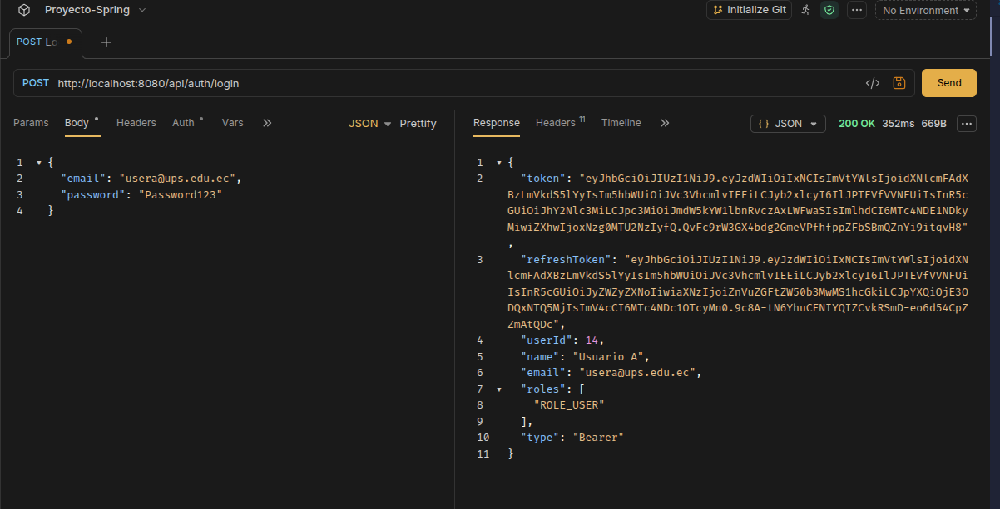

---

### 33. POST `/api/auth/refresh` — renovación exitosa

Se envía el `refreshToken` obtenido en el login. El servidor lo valida, lo revoca y retorna un `token` y `refreshToken` completamente nuevos, distintos a los originales.

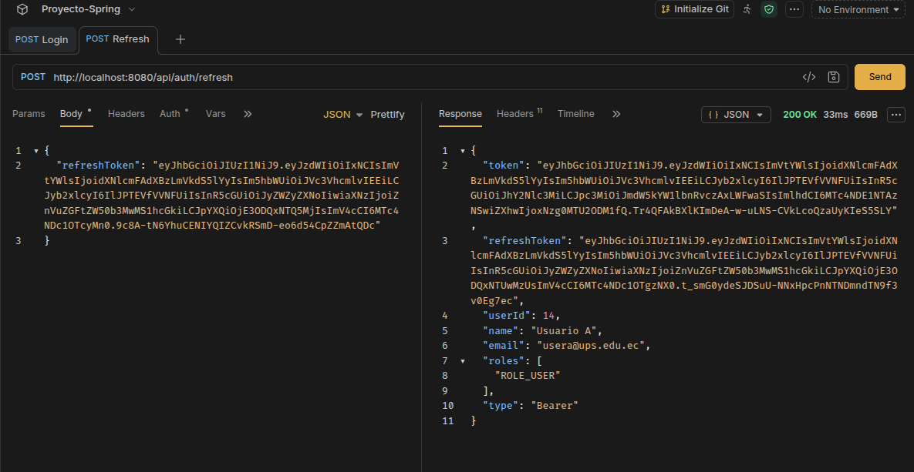

---

### 34. POST `/api/auth/refresh` — reutilización de un refresh token ya rotado

Se intenta usar nuevamente el refresh token del login, que ya fue revocado durante el paso anterior. El servidor responde `400 Bad Request` con el mensaje `Refresh token no encontrado o revocado`, confirmando que la rotación impide la reutilización.

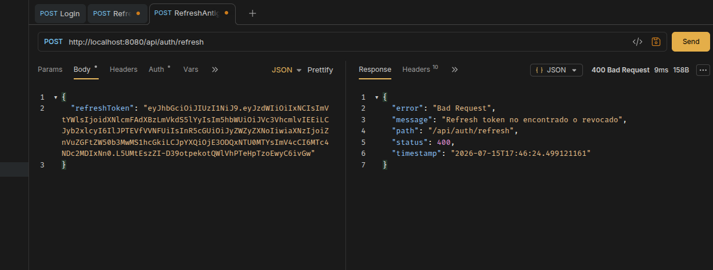

---

### 35. POST `/api/auth/logout` — cierre de sesión

Se envía el refresh token vigente (el emitido en el paso de renovación). El servidor lo revoca y responde `204 No Content`.

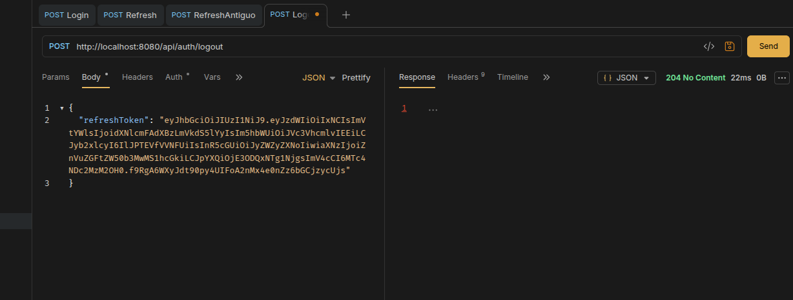

---

### 36. POST `/api/auth/refresh` — intento de renovación después de logout

Con el mismo refresh token ya revocado por el logout, se intenta renovar sesión nuevamente. El servidor responde `400 Bad Request` con el mensaje `Refresh token no encontrado o revocado`, confirmando que el logout invalida el token de forma permanente.

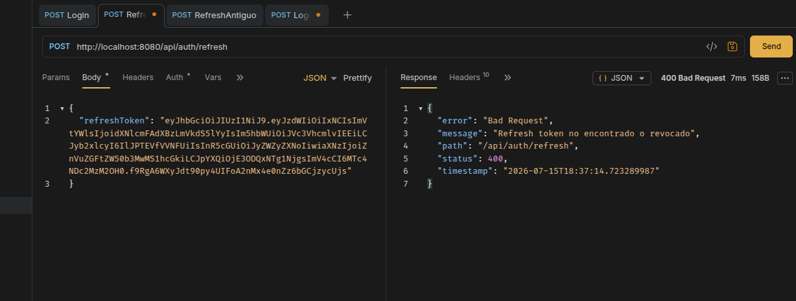

---

## Explicación personal — Práctica 14

### Diferencia entre access token y refresh token

El access token es el que se envía en cada petición protegida mediante `Authorization: Bearer <token>`; tiene una duración corta (30 minutos en este proyecto) y no se guarda en base de datos, ya que su validez depende únicamente de la firma y la expiración del JWT. El refresh token, en cambio, no se usa para consumir endpoints protegidos: solo se envía al endpoint `/api/auth/refresh` para obtener un nuevo access token. Dura más tiempo (7 días) y sí se persiste en base de datos, porque eso es lo que permite revocarlo antes de que expire.

### Por qué el refresh token no debe usarse en `Authorization: Bearer`

Si el backend aceptara un refresh token como si fuera un access token, un token pensado únicamente para renovar sesión —de vida mucho más larga— quedaría habilitado para acceder a cualquier endpoint protegido. Esto amplía innecesariamente la ventana de riesgo: si un refresh token se filtra, un atacante podría usarlo directamente para consumir la API durante días, en lugar de estar limitado a los 30 minutos de un access token. Por eso `JwtAuthenticationFilter` valida explícitamente que el token tenga `type: access`, y `/auth/refresh` valida por separado que el token recibido tenga `type: refresh`.

### Qué significa rotar un refresh token

Rotar un refresh token significa que, cada vez que se utiliza para renovar la sesión, ese token se revoca inmediatamente y se genera uno nuevo en su lugar. De esta manera un mismo refresh token nunca puede usarse dos veces: si alguien intentara reutilizar uno ya rotado —ya sea el usuario legítimo por error o un atacante que lo haya interceptado— la petición es rechazada con `400 Bad Request`, tal como se evidencia en las pruebas 34 y 36. Esto limita el daño potencial de un refresh token comprometido, porque su ventana de uso útil se reduce a una sola operación de renovación.

---

# Práctica 15 — Despliegue en Producción

## Objetivo

Preparar el proyecto para desplegarse en un entorno real: separar la configuración por ambiente (`dev`/`prod`), exponer health checks con Spring Boot Actuator, empaquetar la aplicación en una imagen Docker optimizada con build multi-stage, orquestarla junto a PostgreSQL con Docker Compose, y dejar listo el archivo de despliegue para un PaaS (Render).

---

## Lo que se implementó

### 1. Configuración por ambiente (profiles)

`application.yml` quedó solo con la configuración común a cualquier ambiente (puerto, context-path, JWT, Actuator) y activa un profile por defecto:

```yaml
server:
    port: ${PORT:8080}
    servlet:
        context-path: /api

spring:
    application:
        name: fundamentos01
    profiles:
        active: ${SPRING_PROFILES_ACTIVE:dev}
    jpa:
        open-in-view: false
```

`application-dev.yml` concentra lo que solo tiene sentido en la máquina del desarrollador: la conexión a la base de datos local (`localhost:5433`), `ddl-auto: update` para que Hibernate cree las tablas automáticamente, y logs en `DEBUG`.

`application-prod.yml` no trae ningún valor por defecto para datos sensibles — si falta una variable de entorno, el arranque debe fallar en vez de usar un valor inseguro:

```yaml
spring:
    datasource:
        url: jdbc:postgresql://${DB_HOST}:${DB_PORT}/${DB_NAME}
        username: ${DB_USERNAME}
        password: ${DB_PASSWORD}
    jpa:
        hibernate:
            ddl-auto: ${JPA_DDL_AUTO:validate}
```

La URL se arma a partir de `DB_HOST` / `DB_PORT` / `DB_NAME` en lugar de una sola variable `DATABASE_URL`, porque proveedores como Render o Railway exponen esos datos como propiedades separadas, no como una URL con el prefijo `jdbc:` ya incluido.

`ddl-auto` en producción es `validate` por defecto (nunca crea ni modifica tablas), pero se puede sobreescribir con `JPA_DDL_AUTO=update` — se usa así únicamente en `docker-compose.yml` para el primer arranque local, donde el volumen de Postgres empieza vacío y todavía no existe ningún esquema previo que validar.

---

### 2. Spring Boot Actuator

Se agregó la dependencia y se expusieron únicamente los endpoints necesarios:

```kotlin
implementation("org.springframework.boot:spring-boot-starter-actuator")
```

```yaml
management:
    endpoints:
        web:
            exposure:
                include: health,info,metrics
    endpoint:
        health:
            show-details: when-authorized
    health:
        db:
            enabled: true
```

En `SecurityConfig` se protegió el resto de Actuator, dejando público solo el health check (necesario para que Docker y Render puedan monitorear la app sin autenticarse):

```java
.requestMatchers("/actuator/health").permitAll()
.requestMatchers("/actuator/**").hasRole("ADMIN")
```

---

### 3. Dockerfile multi-stage

Dos etapas: la primera compila con el Gradle Wrapper del proyecto sobre una imagen con JDK 25; la segunda copia solo el `.jar` resultante a una imagen liviana con JRE 25 sobre Alpine, sin dejar código fuente ni herramientas de build en la imagen final.

```dockerfile
FROM eclipse-temurin:25-jdk-alpine AS builder
WORKDIR /build
COPY gradlew settings.gradle.kts build.gradle.kts ./
COPY gradle ./gradle
RUN chmod +x gradlew
RUN ./gradlew dependencies --no-daemon
COPY src ./src
RUN ./gradlew bootJar -x test --no-daemon

FROM eclipse-temurin:25-jre-alpine
RUN addgroup -S spring && adduser -S spring -G spring
WORKDIR /app
COPY --from=builder /build/build/libs/*.jar app.jar
RUN chown spring:spring app.jar
USER spring:spring
EXPOSE 8080
HEALTHCHECK --interval=30s --timeout=3s --start-period=60s --retries=3 \
  CMD wget --no-verbose --tries=1 --spider http://localhost:8080/api/actuator/health || exit 1
ENV SPRING_PROFILES_ACTIVE=prod
ENTRYPOINT ["java", "-Djava.security.egd=file:/dev/./urandom", "-Xms256m", "-Xmx512m", "-jar", "app.jar"]
```

El contenedor corre con un usuario no-root (`spring`) y el `HEALTHCHECK` reutiliza el mismo `/actuator/health` protegido solo parcialmente por Spring Security.

---

### 4. Docker Compose

`docker-compose.yml` levanta PostgreSQL y la API juntas, con la API esperando a que la base de datos esté `healthy` antes de arrancar:

```yaml
services:
  postgres:
    image: postgres:16-alpine
    environment:
      POSTGRES_DB: devdb
      POSTGRES_USER: ups
      POSTGRES_PASSWORD: ups123
    healthcheck:
      test: ["CMD-SHELL", "pg_isready -U ups -d devdb"]

  api:
    build: .
    environment:
      SPRING_PROFILES_ACTIVE: prod
      DB_HOST: postgres
      DB_PORT: 5432
      DB_NAME: devdb
      JPA_DDL_AUTO: update
    depends_on:
      postgres:
        condition: service_healthy
```

---

### 5. Blueprint de Render (`render.yaml`)

Queda listo para desplegar en Render con `New → Blueprint` apenas se conecte el repositorio: crea un servicio de PostgreSQL administrado y el servicio web construido desde el mismo `Dockerfile`, inyectando `DB_HOST`, `DB_PORT`, `DB_NAME`, `DB_USERNAME` y `DB_PASSWORD` a partir de la base de datos, y generando `JWT_SECRET` automáticamente.

---

## Evidencias — Práctica 15

### 37. Arranque con perfil `dev`

Salida de `./gradlew bootRun --args='--spring.profiles.active=dev'`: Tomcat inicia en el puerto 8080 con el context-path `/api`, Hibernate crea el esquema y Actuator expone 3 endpoints.

```
o.s.b.a.e.web.EndpointLinksResolver : Exposing 3 endpoints beneath base path '/actuator'
o.s.boot.tomcat.TomcatWebServer     : Tomcat started on port 8080 (http) with context path '/api'
e.e.u.i.f.Fundamentos01Application  : Started Fundamentos01Application in 3.314 seconds
```

Verificación de los endpoints de Actuator:

```
$ curl http://localhost:8080/api/actuator/health
{"groups":["liveness","readiness"],"status":"UP"}

$ curl -o /dev/null -w "%{http_code}\n" http://localhost:8080/api/actuator/info
401
```

`/actuator/health` responde público; `/actuator/info` exige autenticación, confirmando que la regla `hasRole("ADMIN")` en `SecurityConfig` está activa.

---

### 38. Build de la imagen Docker

```
$ docker build -t fundamentos01:test .
...
BUILD SUCCESSFUL in 12s
...
naming to docker.io/library/fundamentos01:test done

$ docker images fundamentos01:test
IMAGE                ID             CONTENT SIZE
fundamentos01:test   a4380f571b09   186MB
```

El tamaño final (186 MB) corresponde a una imagen de solo runtime (JRE Alpine + JAR), sin Gradle ni código fuente.

---

### 39. Stack completo con Docker Compose

```
$ docker compose up -d --build
 Container fundamentos01-postgres Started
 Container fundamentos01-postgres Waiting
 Container fundamentos01-postgres Healthy
 Container fundamentos01-api Started

$ docker ps
NAMES                    STATUS                    PORTS
fundamentos01-api        Up 16 seconds (healthy)   0.0.0.0:8080->8080/tcp
fundamentos01-postgres   Up 26 seconds (healthy)   0.0.0.0:5433->5432/tcp
```

Ambos contenedores llegan a estado `healthy`: Postgres mediante `pg_isready` y la API mediante el `HEALTHCHECK` del Dockerfile contra `/actuator/health`.

---

### 40. API funcional dentro de Docker

Con el stack de Compose corriendo (`JPA_DDL_AUTO=update` crea el esquema en el volumen vacío), se registró un usuario real a través del contenedor:

```
$ curl -X POST http://localhost:8080/api/auth/register \
  -H "Content-Type: application/json" \
  -d '{"name":"Docker Test","email":"docker@ups.edu.ec","password":"Password123"}'

{
  "token": "eyJhbGciOiJIUzI1NiJ9...",
  "refreshToken": "eyJhbGciOiJIUzI1NiJ9...",
  "type": "Bearer",
  "userId": 1,
  "name": "Docker Test",
  "email": "docker@ups.edu.ec",
  "roles": ["ROLE_USER"]
}
HTTP:201
```

Esto confirma que, dentro del contenedor, la aplicación se conecta a PostgreSQL, aplica las validaciones y genera access token + refresh token correctamente — el mismo flujo de la Práctica 14 funcionando end-to-end en un ambiente containerizado.

---

## Explicación personal — Práctica 15

### Por qué separar `application.yml` en profiles

Antes de esta práctica, la URL, usuario y contraseña de PostgreSQL estaban escritos directamente en `application.yml`, junto con un secreto JWT por defecto pensado solo para desarrollo. Eso funciona en la máquina local, pero es inviable en producción: ahí la base de datos no es `localhost:5433`, y las credenciales no deberían vivir en el repositorio de código en absoluto. Separar `application-dev.yml` de `application-prod.yml` permite que el mismo JAR se comporte distinto según el ambiente, sin tocar una sola línea de código — solo cambia qué profile está activo y qué variables de entorno existen.

### Por qué `ddl-auto: validate` en producción y no `update`

En desarrollo es cómodo que Hibernate cree o modifique las tablas automáticamente cada vez que cambia una entidad. En producción eso es peligroso: un cambio accidental en una entidad podría alterar el esquema real sin que nadie lo revise primero. `validate` obliga a que el esquema ya exista y solo verifica que coincida con las entidades — si no coincide, la aplicación falla al arrancar en lugar de modificar datos reales sin control. La excepción documentada (`JPA_DDL_AUTO=update` solo en el `docker-compose.yml` local) existe porque este proyecto no usa todavía una herramienta de migraciones (Flyway/Liquibase); en un proyecto real, el primer despliegue crearía el esquema mediante migraciones versionadas, no dejando que Hibernate lo infiera.

### Por qué una imagen Docker multi-stage y no una sola etapa

Si se compilara dentro de la misma imagen que corre en producción, esa imagen final incluiría Gradle, el código fuente completo y todo el caché de dependencias de compilación — información y peso que no aportan nada en runtime y aumentan la superficie de ataque. Separar en dos etapas (`builder` con JDK completo, y una imagen final solo con JRE Alpine) permite descartar todo lo que solo sirvió para compilar. El resultado medido en este proyecto fue una imagen de 186 MB, muy por debajo de lo que pesaría incluir Gradle y el código fuente.

---

# Autor

| Campo       | Detalle                  |
|-------------|--------------------------|
| Nombre      | Marco Cobos              |
| Correo      | marcocobos15@gmail.com   |
| Fecha       | Junio 2026               |
